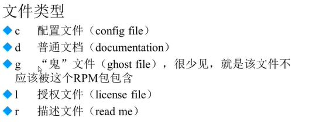
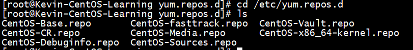

# **VMware的应用：**

快照：

克隆：

## **系统分区：**

------

**Windows：分区，分配盘符，格式化**

> **Linux：分区，分配盘符（挂载），给每个设备建立一个文件，格式化使用**
>
> 分区：将大硬盘分为小的逻辑分区
>
> 格式化：写入文件系统
>
> 分区设备文件名；给每个分区定义设备文件名
>
> 挂载：给每个分区分配挂载点
>
> 
>
> **IDE接口     								 SCSI    							SATA**

/dev/sd[a....]    分区中的编号1~4 只能给主分区或者扩展分区使用，即使主分区或扩展分区没有使用到4，在扩展分区中的子分区（逻辑分区）不能使用1~4

如上图：sdb5,sdb6... 不会将其识别为1~4

逻辑分区永远都是从5开始的

### **挂载：**

#### 必须分区：

- ​		/              (根分区)

- ​		swap分区（交换分区，内存的两倍，不超过2G)

#### 推荐分区：

- ​		/boot（启动分区，200MB,免得根分区满了，难以启动)

- [ ] 

F2 进入BIOS，以前的需要进行 利用光盘启动。（真实机器 上需要修改一下）

swap分区，是没有挂载点的，是给操作系统自己调用的，无法分配挂载点。（直接就是swap类型）

操作系统只能分配四个主分区，第四个主分区会自动被分配为扩展分区，在其中进行逻辑分区。

#### 安装类型：

------

做的越多，错的可能更多。================》   稳定和安全

Kickstart.cfg:  记录安装过程，方便大规模的服务器安装

## 远程登陆管理工具

------

| **桥接：**                               | NAt                          | Host-ONLY           |
| ---------------------------------------- | ---------------------------- | ------------------- |
| 真实的网卡（本地有线+无线连接）          | VMware Net8虚拟网卡          | VMware Net1虚拟网卡 |
| 当前真实计算机进行通信                   | 与真实主机进行通信           | 与真实主机进行通信  |
| 和同网段计算机进行通信                   | /                            | /                   |
| （但是会占用真实**网段**IP）能访问互联网 | 使用共享的主机IP，访问互联网 | /                   |

要与主机进行通信：查看网络属性是否在同一网段之下。

ifconfig  (   winsdows是 ipconfig)  ===>   现在改了   ip addr

if  ====>  interface 

### 网络配置：

Linux中一切皆文件，那么， ipconfig xxx（给网络起个名字,一般从 xxx0开始)  192.168.12.x  只要和主机在一个网段（没有网线的话就是自动获得的）

--------》  这个只是临时设置，需要修改配置文件才是永远的，一切皆文件，硬件也是文件

桥接有两个 有线&& 无线：可能是 VMware 中虚拟环境配置，需要自动桥接成了无线或有线，选择其中一个。

### 快速链接工具：

[SecurGRT]: https://zhuanlan.zhihu.com/p/163089404

有的Linux禁止使用root直接登录，需要利用普通用户登录。

### Winscp:

windows和Linux之间进行文档的拷贝，登录同上方法。

### linux:注意事项

1. 大小写敏感
2. 后缀名，Linux不需要后缀名（扩展名），一切皆文件（硬件也是）
3. 但是自己也可以扩展名（主要让管理员区分)
4. 
5. Linux的所有存储设备必须挂载后使用（包括硬盘，U盘。。。）
6. 

### 服务器的注意事项：

​			不允许关机，只能重启，重启时应该关闭服务。不要再服务器访问高峰运行高负载命令。远程配置防火墙时不要把自己提出服务器。密码规范，定期更新，合理分配权限，定期备份。

## **遇到的问题：**

------

1. ping不通： 现在ifconfig 不用了，使用 ip addr 
2. 现在好像不用自己配置IP了
3. 修改命令： ip addr add ip地址 dev ens33
3. **yum install -y xxx   用来安装某内容**
4. 端口号

> ~~~word
> ●检查SSH软件包是否已安装：
> rpm -q openssh-server
> 如果openssh-server软件包已安装，将会显示软件包的版本信息。
> ●如果未安装，你可以通过以下命令来安装它：
> sudo yum install openssh-server
> 
> ●检查SSH服务状态：注意端口号
> systemctl status sshd
> ●如果SSH服务已经安装并启动，你将会看到类似以下的输出：
> 
> ● sshd.service - OpenSSH server daemon
>   Loaded: loaded (/usr/lib/systemd/system/sshd.service; enabled; vendor preset: enabled)
>   Active: active (running) since [日期时间]
>     Docs: man:sshd(8)
>         man:sshd_config(5)
> Main PID: [PID号] (sshd)
>   CGroup: /system.slice/sshd.service
>           └─[PID号] /usr/sbin/sshd -D
>           
> ●如果SSH服务未安装或者未启动，你可以通过以下命令来安装并启动它：
> 
> sudo yum install openssh-server
> sudo systemctl start sshd
> sudo systemctl enable sshd
> ~~~
>

# **DAY2** 

**命令格式   [-可选] 【参数】 **

> ****  例如： ls -la /etc    里面的可选的意思是有的可能没有****

**ctr + c 终止操作**

## ls   

> ​		**list ; 所在路径  /bin/ls   显示目录文件    语法描述**
>
> -a  -l  -h  -i  -d
>
> 三个命令可以混合使用    -la   -ld    -lh
>
> ​		**ls -a  显示所有文件  all ，包括隐藏文件**，**Linux中  . 开头的**
>
> ​						**隐藏文件目的：主要是为了不太让修改，除非你确定要改**
>
> ​		**ls -l 详细信息显示**  long  下图中 **1** 表示这个文件被引用的次数。
>
> ​					 **root 表示用户的身份和文件的关系：所有者（理论创建者，一个，但是能转换），所属组（多							人），其他人**
>
> ​					**第四个参数： root  文件的所属组**
>
> ​					**第五个参数： 文件的大小：字节单位**
>
> ​					**第六个参数：最后修改时间**，
>
> ​									注意：Linux没有创建时间这个概念，文件最后一次访问时间，状态修改时间，数据修改时间
>
> ​		**ls  -lh   人性化显示   h 这个选项是通用的**
>
> **-rw-r--r--**参数：最常见的三种文件
>
> - -表示是文件 ，如果是d 表示是目录，如果是l 开头，表示是一个软连接
> - rw-   r-- r--
> - u       g    o          u:所有者，g 所属组   o 其他人
> - r 读权限    w 写权限   x 执行权限  ，没有字母用 — 表示没有权限
>   - 只要够使用就行
> - 下图所示：
> - 其余文件类型：字符设备文件，块设备文件，套接字文件，管道符文件....
>
> ​	**ls -d  查看目录属性**
>
> ​		这是针对当前目录显示信息。
>
> **ls -i**:
>
> ​		每个文件都有一个id号码，怎么查看呢？就利用  ls -i

## **mkdir**

> 功能：创建目录，一般只能创建单级目录，
>
> **mkdir -p /tem/hello/day1**    /temp/Kevin/Na
>
> - -p   递归创建
> - 在一个目录下同时创建多个新目录，即使原来不存在的目录
> -   同时创建多个目录，

## cd 

> **cd  /要切换到的目录**
>
> **.**   当前目录
>
> **cd ..**     当前目录的上级目录（一定要带空格

## **pwd**

> 显示当前目录的绝对路径

## **rmdir**

> 功能：删除**空**目录
>
> rmdir 【目录名】

## **cp**

> 复制文件或目录
>
> **cp  -【rp】 【源文件或目录】【目标目录】**
>
> **cp 源文件目录/源文件  /目标文件目录**
>
> - 如果复制源文件，不需要加上  -r 
> - cp 源文件目录/源文件   目标文件目录
> - 可以同时复制多个文件   cp /temp/1.log /temp/2.log  /root
> - 复制过去的文件利用  ls -l 查看，最后修改时间是不一样的
> - 如果想要保留源文件的属性，那么记得加上 -p
>
> **cp -r 复制目录**
>
> - 针对目录进行复制
> - 对复制过去的目录修改文件名   cp -r /temp/longze /root   这样不会修改文件名
> - cp -r /temp/longze /root/cang18+  将目录直接改名了
>
> **cp -p 保留文件属性**

## **mv**

> **mv 【源文件或目录】 【目标目录】**
>
> 功能：剪切和改名
>
> - 可以一次剪切多个文件或者目录
> - 可以改名：和cp 差不多
> - 当前文件改名   mv  文件名 要改的名

## **rm**

> **rm  -{rf] 【文件或目录】**
>
> - -r   删除目录
> - -f 强制执行,强制执行删除文件
> - -rf   强制删除目录
>
> 用于删除文件
>
> rm -rf *         删除当前目录下所有文件

## **touch**

> 命令所在路径 /bin/touch
>
> Linux不限制文件名，所有符号都可以 带空格的文件
>
> + touch "xxx xxx"   必须要加双引号
> + 执行权限：所有用户
> + touch [文件名]

## cat

> 功能：显示文件内容
>
> 权限：所有用户
>
> + cat  文件名
> + cat  -n 文件名  
> + -n 用于显示行号

## **tac**

> 反向列示，cat  就是倒着来显示 
>
> 用法和cat一致，但是不支持 -n

## **more**

> 功能：分页显示文件的内容，当文件太长的时候，
>
> 权限：所有用户
>
> + more [文件名]
> + 空格 或者 f    ====>   翻页
> + enter       ======>  换行
> + q 或者 Q   ======》 退出

## **less**

> less [文件名]
>
> + 分页显示所有文件内容（可向上翻页）
> + pageup  按页往上翻
> + ⬆   向上换行
> + /关键词       =====>    搜索关键词，斜杠不要少，同时 按下  n 表示下一个关键词所在的位置

## **head**

> + 功能： 看一个文件的前几行，所有用户权限
> + head [文件名]     ===>  默认显示前10行
> + head    -n x   [文件名]   ===》 -n 用于指定行数，x是行数

## **tail**

> + 查看末尾的几行，默认是 10
>
> + tail [文件名]
>
> + tail -n x [文件名]
>
>   
>
> + 动态显示文件末尾的内容，动态随日志内容变化而显示
>
> + tail -f [文件名]

## **ln**

> + 功能： link  生成链接文件，所有用户权限
> + /bin/ln 中
> + ln -s [源文件 ]   [目标文件]
>   + 目标文件一定不存在
>   + ​	-s   创建软链接
>   + 软连接，类似于快捷方式，所有用户都对文件有操作权限；利用 ls -l 查看文件的一些详细信息；l 开头，三个rwx ; 一定是符号链接 ；一定有箭头指向源文件
> + ln [源文件 ]   [目标文件]
>   + 生成硬链接
>   + 与cp -p 的区别：
>     + cp -p  + 同步更新   （源文件和目的文件同步更新)
>   + 例如：echo  "xxxx"   >>[文件名]  
>     + 将xxx 写入文件的最后一行
>     + 源文件丢失，也能存在
> + 怎么区分软硬连接： ls -i [文件]
>   + 硬链接 与源文件id 号一致
>   + 软连接与源文件id不一致
>   + 同步更新：映射到了同一个i节点，所以同步更新
> + 软硬连接的区别： 
>   + 硬链接不能跨分区，/boot   /etc   /
>   + 硬链接不能针对目录使用
>   + 硬链接可以用来备份，软连接用来快捷方式

# **DAY3** 

## **权限管理**

> 更改文件权限：所有者  root
>
> 所有者 u（一般是文件创建者） 
>
> 所属组 g(只能有一个)  
>
> 其他人 
>
> 权限： rwx

### **chmod**

> 功能： 权限更改命令  change the permissions mode of a file
>
> + 执行权限：所有用户    /bin/chmod
> + chmod  [{ugoa}{+_=}{rwx}] [文件或目录] 
>   + [rwx=421] 利用数字代表权限 ，那么就用
>     + rwx  权限是 7 r 权限是4
>   + **-R  递归修改**
>     + 改变目录权限同时，目录下所有的文件权限也修改了。
>   + a 代表所有人，这里就是正则那种类似的。
>     + chmode u=rwx,g=r--,o=--- [文件] ==chmod 640 

### **rwx****权限的理解**

> + 文件中的 rwx 权限
>
>   			+		r : 查看文件内容 cat/more/less/head/tail
>
>   +		w: 修改文件内容，并不是删除文件的权限；vim
>      +		只有对文件目录有w权限才能删除
>   +		​	x : 执行权限  script ,command 
>
> + 目录中的 rwx 权限
>   + r : 列出目录中的内容    ls
>   + w:   创建，删除文件，touch/mkdir/rm
>     + 即使子文件夹没有 w权限，但是主文件夹有w,那么可以对其进行操作。删除文件的权限实际是对目录的写权限
>   + x： 执行权限 cd 

### *添加新普通用户*

> useradd xxx
>
> passwd 用户名
>
> groupadd xxx

### **chown**

> 功能：改变文件的所有者 change file ownership
>
> 权限：只有root可以进行修改   /bin/chown
>
> + chown [用户] [文件或目录]
>   + 改变某文件的所有者为 某用户
>   + 前提：用户要存在

### **chgrp**

> 功能：改变文件所属组  change file group ownership
>
> + /bin/chgrp
> + chgrp [用户组名]  [文件或目录]

### **umask ****** 重要**

> 功能：
>
> + umak -S   
>
>   + 显示新建文件的缺省权限
>   + **linux 中所有新建的文件都是 没有 x 执行权限的**
>   + touch 是创建文件
>
> + umask
>
>   + 0022
>
>     + 0 特殊权限
>
>     + 022 ：所有者 所有组 其他人 异或的关系
>
>     + > 777    rwx rwx rwx 
>       >
>       > 022     ---  -w-   -w-
>       >
>       > ---------------------------
>       >
>       > 结果    rwx r-x r-x  目录
>       >
>       > 结果    rw- r-- r--    文件
>
>   + 修改默认缺省权限：umask xxx   注意与的操作

## **搜索命令**

### **find**

> + /bin/find  功能 ：文件搜索  ,  所有用户权限
> + find [搜索范围] [匹配条件]
> + 匹配条件如下
>   + -name [文件名]
>     + find /etc -name init  精确匹配，
>     + find /etc -name 星号*init星号*      模糊搜索，正则规则类似
>     + find /etc -name init???   正则规则
>   + -iname   不区分大小写查找
>   + -size  指定文件的大小  + - =   大于多大的文件（数据块512字节）
>     + find /etc -size +204800 
>   + -user   [所有者]
>     + 在根目录下查找所有者为 xxx 的文件
>   + -group [所属组名]
> + 根据时间查找
>   + -cmin  {+-=}x
>     + 查找x分钟内被修改过属性的文件/目录  ls -l 看到属性
>   + -amin  [+-=]x 
>     + 访问时间
>   + -mmin [+-=]x
>     + 文件内容的修改   modify
> + 根据文件类型查找
>   + -type [fdl]     f文件，d目录，l链接 
> + 根据节点查找
>   + -inum [i节点号]
>   + 可能有个文件内容始终带莫名其妙的符号，通过这个进行操作
>   + 查看有没有硬链接
> + 多个筛选条件
>   + -a   表示and  
>   + -o   表示or
>     + find /etc -type f  -a -size -204800

### -exec/-ok  操作 {}  \;

> + 功能：对查找到的结果作什么操作
> + {}   表示find查找的结果，\ 调试转义符  ;  表示结束
> + find /etc -type d -exec ls -lh {} \;

### **locate**

> + /usr/bin/locate      所有用户权限，功能：在**文件资料库**中查找文件
>
> + locate 文件名
>
>   > + updatedb 
>   >   + 更新资料库
>   > + locate -i 文件名
>   >   + 不区分大小写
>
>   + 新收录的文件找不到，文件库没有更新
>   + tmp 下面的文件找不到

### **which**

> 功能：搜索命令所在目录及其别名信息  /usr/bin/which   所有用户权限
>
> + which  命令名
>   + 例如 rm 需要确认机制，实际上就是别名的功能，如果直接原来的名称删除，不需要确认机制

### **whereis**

> 也是找到命令所在的路径，
>
> + whereis 命令
>
> + 区别：还能找到命令所在的帮助文档的的位置 

### **grep**

> 功能： 在**文件内容中**进行搜索匹配（类似正则？）,返回的是匹配到的字串所在的行并输出，           /bin/grep
>
> + grep -[iv] [指定字串] [文件]
>   + -i       不区分大小写,默认都区分大小写
>   + -v       排除指定字符（利用正则规则就可以）

## **帮助命令**

------

### **man**

> 功能：manual      用户手册，获得帮助信息   /usr/bin/man   所有用户权限
>
> + man [命令或配置文件]
>
>   + 进入后按下  f 或者 空格 翻页；enter  下一行；  q 退出  /关键词
>
>   + more 和   less 的综合体
>
>   + 一般用于查看命令功能,所有的选项等，一般最前面那行
>
>         + man xxx
>    + man services         /etc/services  不需要绝对路径，只要名称
> 
>   + 查看文件：文件功能；文件的格式是什么样的
>
> + man passwd   优先查看命令的帮助信息； 1  表示命令帮助，5便是配置文件的帮助  
>
>   + man 5 passwd

### **whatis** ****

> 功能：查看命令的简单功能
>
> + whatis 命令

### **apropos**

> 功能：查看配置文件的简单信息
>
> + apropos 配置文件（无绝对路径)
>   + apropos services

### --**help**

> 功能：获取命令的选项有哪些
>
> + 命令   --help

### **date**

> 功能：显示日期
>
> 如果要修改日期：date xxx 
>
> ​		具体用法去man 里面找，随用随找

### **info**

> 和man 差不多

### **help**

> + shell  内置命令      ，所有用户权限
> + 功能：获得shell内置命令的帮助信息，一些命令直接用 which man 之类的找不到路径，很可能是shell内置的命令，就得用 help
> + help  命令   
>   + help umask

# **DAY4**

## 用户管理命令

### useradd

> 功能：添加新用户  /usr/sbin/useradd       只有root权限
>
> + useradd  用户名

### **passwd**

> 功能：设置用户密码   /usr/bin/passwd   所有用户权限
>
> + passwd  用户名

### **who**

> 功能：查看简略的登录用户信息       /usr/bin/who  所有用户权限
>
> + who 
>   + 
>   + 登陆用户名    登陆终端（tty 本地终端   pts 远程登录)  
>     + ​	登录时间 		最后一部分：登陆主机的IP地址

### **w**

> 功能：详细查看登陆用户的信息 
>
> 
>
> + up 说的是 系统的连续运行时间  ==  命令 uptime   后面的事系统的负载情况，服务器可以直观的看到
> + IDLE:  用户登陆后累计空闲时间
> + JCPU:   执行的命令累计占用CPU的时间
> + PCPU： 用户当前登录后当前执行的操作占用CPU的时间
> + WHAT: 当前执行的操作  -bash  表示等待执行（啥都没有）

## **压缩解压命令**

------

一定注意，后缀名的问题，得自己写

### .**gz**

> 用于压缩文件，压缩格式     .gz    ；  /bin/gzip      所有用户权限   yo
>
> + gzip [文件]
> + 一定要注意，**只能压缩文件**；**压缩后删除原文件**
>
> 解压缩：两种方式  /bin/gunzip    所有用户权限
>
> + gzip -d [压缩文件]
> + gunzip [压缩文件]

### **tar**

> 功能：打包目录   /bin/tar    所有用户权限
>
> 注意，后缀名是自己写的，一般都写   .tar
>
> + tar  -[zcf] [压缩文件名] [目录]
>   + -c   打包
>   + -z    打包同时压缩
>   + -f     指定文件名 ，一定要加 写在最后
>   + -v      显示详细信息
>   + tar  -cfz  xxx.tar.gz  xxx
> + 对目录打包之后，就可以通过 gzip  压缩了。
>   +  xxx.tar.gz
>
> 解压缩包：
>
> + tar -[zxvf]  [压缩包名]
>
> + 就只是将 -c   换为  -x
>   + -x   解包，其余命令不变
>   + tar -zxfv xxx.tar.gz

### **zip**&&**unzip**

> 功能：压缩文件或目录得到   .zip    /usr/bin/zip      所有用户权限
>
> 能保留原文件
>
> + zip   [-r]  [压缩后文件名]   [文件或目录]
>   + 没有 -r 默认是 压缩文件
>   + -r 压缩目录
> + unzip  [压缩文件]

### **bzip2&&bunzip2**

> zip的升级；    /usr/bin/bzip2   所有用户权限
>
> + bzip  [-k]  [文件]
>
>   + -k    保留源文件，  默认压缩后删除源文件
>
>   + .bz2  压缩后文件格式
>
> + tar -cjf  [压缩后文件名]   [目录名]
>   + 将 -z  换为  -j   就可以生成   xxx.tar.bz2  格式
>
> 解压缩：
>
> + bunzip2  [-k]   [文件名]
>   + -k  解压后保留源文件，默认不保留
> + tar -xjf  xxx.tar.bz2
>   + 解压缩目录

# **DAY5 网络命令**

### **write**

> - /usr/bin/write   所有用户权限
> - 功能： 给用户发送信息  ctrl + D 保存结束
> - 语法：
>   - write <用户名>
>   - 一定是在线用户才能发，非在线用户无法接收
>   - 
>   - 

### **wall**

> + /usr/bin/wall      所有用户权限
> + 功能：发广播信息
> + 语法：
>   + wall [message]
>   + 相当于  write all
>   + 无条件全部接受了

### **ping**

> + /bin/ping     所有用户权限
> + 功能：测试网络连通性
> + 语法：
>   + ping [-c n] IP地址
>     + -c 可以指定发送的次数，默认是一直ping
>     + ping -c 4 127.0.0.1

### **ifconfig**

> + /sbin/ifconfig   root权限
> + 功能：查看和设置网卡信息
> + 语法：
>   + ifconfig 网卡名称  IP地址
>   + **i**nter**f**ace **config**uration   接口配置
>   + 例如： ifconfig eth0 192.168.1.156
>     + eth0代表本地的真是网卡
>     + 如果有第二张网卡eth1
>   + 现在好像被改为了 ip addr 
>   + 
>   + 

### **mail**

> + /bin/mail   所有用户权限
> + 功能：查看发送电子邮件
> + 可能需要安装包： yum install mailx
> + 语法：
>   + mail [用户名]
>   + ctrl + D 保存结束
>   + 不要求在线，主要用于收系统给你发送的信息
>   + 一定用好help,还可以回复
>   + 
>   + 

### **last**

> + 日志查询命令，查看用户登录信息   所有用户权限
> + /usr/bdin/last      
> + 语法：
>   + last 

### **lastlog**

> + lastlog   记录的是某特定用户上次登录的时间
> + /usr/bin/lastlog 所有用户权限
> + 用法：
>   + lastlog [-u 用户的UID]
>     + -u  UID  特定用户的登录信息

### **traceroute**

> + /bin/traceroute         所有用户权限
> + 功能：显示数据包到主机之间的路径
> + 语法：
>   + traceroute www.sina.com.cn
>   + traceroute [-T/-I] www.sina.com.cn
>     + 采用ICMP / TCP 协议
>     + 默认采用UDP协议

### **netstat**

> + /bin/netstat   所有用户权限
> + 功能：显示网络相关信息
> + 语法：yum install net-tools -y
>   + netstat [-tulrna]
>     + -t  :  TCP 协议
>     + -u
>     + -a:  all 
>     + -l:  监听 listen
>     + -r  :  路由
>     + -n  :  显示IP地址和端口号
>   + netstat -an
>     + 查看所有  机器上进程和互联网的连接，下方法的是本机的连接
>     + 
>   + netstat -rn : 查看本机路由列表
>   + netstat -tunl : 查看本机监听的都暗扣

### **setup/nmtui**

> + 在centos7 中采用  nmtui  或者 yum install setuptool -y安装
> + 功能：配置网络    /usr/bin/setup         root权限
> + 用法：
>   + nmtui           
>   + 配置完成网络IP等信息后
>     + service network restart
> + 永久生效

### **mount** 

> + /bin/mount   所有用户权限
> + 功能： 把设备连接到分配的挂载点，光盘，U盘等折别手动挂载（无图形界面的服务器）
> + 什么是挂载：找到硬件，分配设备文件名，找盘符，将设备文件名和盘符连接起来
> + 语法： 
>   + mount [-t 文件系统] 设备文件名 挂载点
>   + mount -t iso9660 /dev/sr0 /mnt/cdrom
>     + 先创建挂载点，以前只有mnt 现在还有 media 等
>     + -t iso9660   固定的，也能省略，默认就是他
>     + /dev/sr0   固定的 也可以是 /dev/cdrom  软连接
>     + ​	/mnt/cdrom  代表的是你创建的挂载点
> + 

### **umount**

> + 一定要在挂载点外卸载
> + umount  /dev/sr0

## **关机重启命令**

### **shutdown**

> + shutdown [选项]  时间
> + -c  : 取消前一个关机命令
> + -h:  关机
> + -r  :  重启
> + -n  : 现在进行

### **halt **     **poweroff**       **init 0**

### **reboot**  ==    **init 6**

### **系统运行级别 init**

> + 0 关机
>
> + 1  单用户（启动最小的程序,类似Windows安全模式，修复程序)
>
> + 2  不完全多用户，不含NFS服务
>  + network file system 文件共享传输。安全性
>   
>+ 3  完全多用户
> 
>+ 4 未分配
> 
>+ 5 图形界面
> 
>+ 6 重启
> 
>
>   
>+ **怎么记？**
> 
>  + cat /etc/inittab  可惜已经不用了
>   + 修改系统默认运行级别
>     + id:3:initdefault:
>   + 查询当前运行级别
>     + runlevel

### **logout 退出登录**

# **DAY6** VIM

简介：文本编辑器，建立，编辑，显示文本文件

> + yum install vim -y 
> + 编辑模式与命令模式
>   + i  进入了编辑模式
>   + esc 退出，进入命令模式
>     + 需要在命令模式中输入
>       + :命令，参能执行命令 冒号必不可少
>       + :set number     设置行号

### **输入：**

> + a  :表示在光标所在的字符后插入（追加）
> + A:光标所在行尾追加
> + i:        字符前插入
> + I:   行首插入
> + o : 光标下插入新航
> + O:   光标上插入新行

注意，下面的  ： 不能省略

### **跳转：**

> + set nu   设置行号
> + set nonu  取消行号
> + gg 到第一行
> + G   到最后一行
> + nG  到第 n 行   
> + ： 到第 n 行  :1000 到1000行
> + $  移到行尾
> + 0  移到行首

### **删除：**

> + x      删除光标所在处字符
> + nx 删除光标所在处后 n 个字符  例如： 66x  删除66
> + dd  删除光标所在行
> + ndd 删除 n 行
> + dG 删除光标所在行到文件末尾的内容
> + D    删除光标所在处到行尾的内容
> + :n1,n2d         删除指定范围的行 例如： 333，555d

### **复制和剪切：**

> + yy    复制当前行
> + nyy     复制当前行以下 n 行   44yy
> + dd      剪切当前行
> + ndd      剪切当前行以下 n 行
> + p/P     战且在当前光标所在行下/上

### **替换或取消：**

> + r     取代光标所在处字符
> + R    从光标所在处开始替换字符，esc结束
> + u     取消上一步的操作

### **搜索和搜索替换：**

> + /string      搜索指定字符串（忽略大小写   :set ic)
> + n          搜索指定字符串的下一个出现位置
> + :%s/old/new/g           全文替换指定字符串
>   + %s 表示全文替换
> + : n1,n2s/old/nuw/g        在一定范围内替换指定字符串
>   + n1 起始行  n2 终止行

### **保存和退出：**

> + :w 保存修改
> + :w new_filename   另存为指定文件
> + :wq       保存退出
> + ZZ     保存退出快捷键
> + :q!  不保存退出
> + :wq!   强制保存修改并退出（文件所有者及root可用）

### **技巧：**

> + :r  filename
>
>   + 导入文件的内容到当前光标所在处
>
> + :!命令               
>
>   + 导入命令执行的结果       :!which
>
> + :r ！命令      
>
>   + 将当前命令执行的结果导入到文件中
>   + :r !date
>
> + :map 快捷键，触发命令G
>
>   + 自己设置快捷键
>   + :map ^P I#<ESC>    一定注意，P前面用的是ctrl+v
>     + I调到行首插入# 退出编辑模式
>     + 代表按下 ctrl+p 之后，执行相应命令
>   + :map ^B 0x
>
> +   连续行注释
>
>   + :n1,n2s/^/#/g   
>     + ^ 表示行首，# 表示的是添加的东西
>     + // 中间不写表示替换为空
>   + :n1,n2s/^#//g   
>     + 以#开头行首的的都替换掉
>   + :n1,n2s/^/\/\//g   
>     + /\  这个是 / 和 \ 的组合，C语言中 // 注释
>     + 为了避免混淆，所以，一般来说都需要先进行转义操作
>
> + 替换：   :ab mymail samlee@lampbrother.net
>
>   + 就是将 a 替换为b
>
>   
>
> + 

**常见的vim命令，一般存储在 /home/username/.vimrc  文件夹下，如果需要命令一直能用，那么需要在相应的文件夹下进行配置**

# **DAY7 软件包**

## **软件包分类：**

​	源码包（直接是C语言源代码包）：子类-->脚本安装包,界面

> - 开源，修改源代码
> - 可以自由选择所需要的功能，例如安装位置，安装插件...
> - 编译安装，系统更稳定也更高效
> - 卸载更加方便（删除目录，不会留下这么多东西）
>
> - 安装步骤哦，尤其大软件LAMP等，
> - 编译时间长
> - 报错新手难以解决，以后可以去试试利用源代码安装Linux

​	二进制包（编译好的机器语言）（RPM包==EXE格式，系统默认包）

> RPM：直接安装，但是不能看到源代码，，功能选择不如源码灵活
>
> 依赖性： 驱动-->平台--> 支持包 。。。。。。

## **RPM包管理**

------

### **rpm命令管理 包(全)名**

> - rpm包命名规则：
>   - 
>   - Linux其实是没有扩展名这个概念，只是为了给管理员看的
>   - 如果是 noarch : 表示所有平台都可安装
>   - 包名和包全名；不一样，有的命令得用全名（整串命令，包括扩展名)

> RPM包依赖性：
>
> - 树形依赖； a-->b-->c  删除得先从a再到c
>
> - 环形依赖： a-->b-->c-->a  
>
> - 模块依赖：
>
>   - mount -t iso9660 /dev/sr0 /media/cdrom  
>     - 该文件夹下面的Package里面有，红色的就是rpm包
>
>   - 安装包的时候，如果在package里面有这个包，可以按下tab键补全名称，
>   - 有的模块依赖找不到(  以  .sio.数字   结尾的库依赖包，不是独立的包，是某个软件包中的某一个软件，将软件装上就可以安装上该包)
>   - www.rpmfind.net   查询会告诉你装上某个包，这个库也就装上了。

> yum在线管理：
>
> - 解决依赖性的问题。直接一次性安装了依赖的包，不用自己去找，可以不用联网，利用光盘作为本地服务器也能yum

**包全名与包名：**

只对rpm 命令生效，一定利用yum 无论什么都可以用包名

包全名：操作的包是**没有安装的软件包**，同时要注意**路径**---> 安装，升级

包名：操作已经安装的软件包，（系统会搜索 /var/lib/rpm  中的数据库)

### **RPM安装：**

> 用法：  
>
> - rmp  -ivh 包全名
>   - -i   (install)
>   - -v  (verbose 显示详细信息)
>   - -h   (hash  显示进度)
>   - --nodeps       不检测依赖性（但是一般不用，都需要有依赖才能使用)

> 
>
> 显示出来的是包名，这些包都是阿帕奇的包都需要装上，踏实一些扩展功能。包全名需要tab补全，还有  .so.数字类型的模块，需要自己找一下。下图是搜索  libapr-1.so.0()(64bit) 的结果，按照系统以及版本，输入 apr-1.xxx 自动补全（注意在 Packages 中)
>
> 
>
> 
>
> #表示的是 hash 进度，

### **RPM升级：**

> - 只是将 i 换成了U    rpm -Uvh  包全名
>   - -U   （upgrade)

### **RPM卸载：**

> - 已经安装的包都在   /var/lib/rpm  
>   - 直接删除就行了
>   - rpm -e 包名
>     - -e   (erase  删除)
>     - -nodeps   不检查依赖性

### **RPM查询：**

> - rpm -[q i  l  q]  包名/包全名/系统文件名
>   - 已安装的包,不能用yum ，只能用rpm
>   - -a   查询所有的已安装的包
>     - -qa
>   - rpm -ql | grep https
>     - 别忘记了 grep 命令
>   - -i 查询软件信息（information）
>     - -qi
>   - -p 查询未安装包信息
>     - 后面一定是包全名。这是未安装的
>   - -l    列表
>     - 可以用于查询包的安装位置，不管包装没装都可以查询
>   - -f    查询文件系统属于那个软件包 file 
>     - 这个文件必须是包装得出的，自己创建的都不行，都有问题，查不出来
>   - -R  包名   requires   -pR必须在 packages 目录中
>     - 查询软件包的详细信息
>     -  -qR   -pR

### **RPM校验和文件提取：**

> - rpm -V 包名
>   - -V   verify  ( 判断系统文件是否被更改。)
>   - 
>   - 
>   - 

> - 文件提取
>
>   - 目的，可能做了误操作，改变了重要内容。不要重新安装，只需要在指定的rpm 包中提取出来指定的文件，覆盖，就可以解决该错误。例如将ls ,cat 等命令删除了，
>
> - 
>
>   -  \ 代表换行，命令没输完
>
>   - .    代表把指定的文件提取到当前目录下
>
>     
>
>   - rpm2cpio   包全名  | \  cpio -idv . 文件绝对路径
>
>     - rpm2cpio  2是to ,就是进行格式转换  rpm --> apio
>     - cpio 是一个标准工具，用于创建软件档案和从软件档案中提取文件
>
> - 用法：
>
>   - cpio 选项 <[文件|设备]
>     - [选项]
>       - -i  :  copy-in  模式，还原==提取
>       - -d  ： 还原时自动新建目录
>       - -v  :  显示还原过程
>
> - 
>
> - 

# **DAY8  RPM包管理**

## **yum在线管理  **

------

一旦离开了rpm  ,  包名==包全名

### **网络配置**

> - setup  
>
>   - 
>   - 
>
>   
>
> - 
>
>   - 服务器在国外，默认是官网的yum 源，所以可以更换为国内的yum 源
>   - 
>   - 默认是Base 生效， Media 是本地的光盘生效作为yum
>   - 

### **yum命令**

> - yum list
>   - 查询所有可用的软件包列表
> - yum search 关键字
>   - 搜索服务器上所有和关键字相关的包
> - yum  -y install 包名
>   - yum -y install gcc 
> - yum -y update 包名
>   - 升级，如果不加包名，那么所有的软件包都会升级，有的Linux升级的话，那样还得进行一定的配置，寄了
> - yum -y remove 包名
>   - 卸载命令，不加包名，有的包是系统依赖的包，万一卸载的话，系统可能崩了。。。。
> - yum grouplist
>   - 列出所有可用的软件组列表  注意空格 "   "
>   - yum groupinstall 软件组名
>     - 安装指定软件组，组名利用grouplist查询
>     - yum groupremove 软件组名

## **光盘yum源搭建：**

------

- 挂载光盘
- 让网络yum 源文件失效==>  /etc/yum.repos.d/   下enable = no  或者改名，yum主要识别 .repo ,改一下后缀名就可以了
- 修改网盘yum源文件， Media 中enable=yes 
- 关于修改：一定要注意格式问题，缩进很严格，有的加上缩进会有报错。

这里可以看到容器的名称已经不同了

# **挑战：**

- 利用源代码安装Linux
