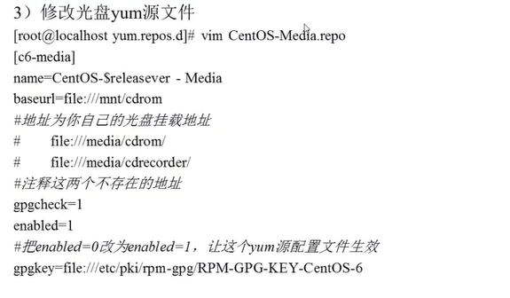
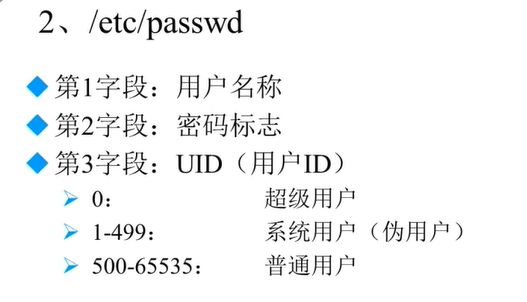
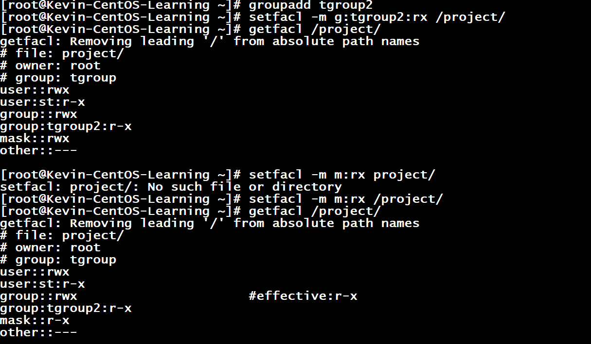
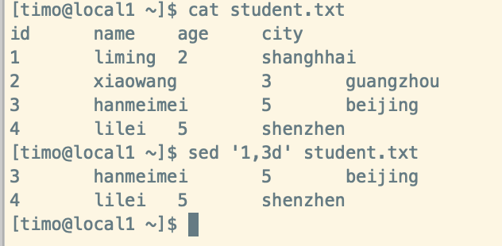

*VMware的应用：**

快照：

克隆：


## **系统分区：**

------

**Windows：分区，分配盘符，格式化**

> **Linux：分区，分配盘符（挂载），给每个设备建立一个文件，格式化使用**
>
> 分区：将大硬盘分为小的逻辑分区
>
> 格式化：写入文件系统
>
> 分区设备文件名；给每个分区定义设备文件名
>
> 挂载：给每个分区分配挂载点
>
> 
>
> **IDE接口     								 SCSI    							SATA**

/dev/sd[a....]    分区中的编号1~4 只能给主分区或者扩展分区使用，即使主分区或扩展分区没有使用到4，在扩展分区中的子分区（逻辑分区）不能使用1~4


如上图：sdb5,sdb6... 不会将其识别为1~4

逻辑分区永远都是从5开始的

### **挂载：**

#### 必须分区：

- ​		/              (根分区)

- ​		swap分区（交换分区，内存的两倍，不超过2G)

#### 推荐分区：

- ​		/boot（启动分区，200MB,免得根分区满了，难以启动)


- [ ] 

F2 进入BIOS，以前的需要进行 利用光盘启动。（真实机器 上需要修改一下）

swap分区，是没有挂载点的，是给操作系统自己调用的，无法分配挂载点。（直接就是swap类型）

操作系统只能分配四个主分区，第四个主分区会自动被分配为扩展分区，在其中进行逻辑分区。

#### 安装类型：

------


做的越多，错的可能更多。================》   稳定和安全


Kickstart.cfg:  记录安装过程，方便大规模的服务器安装

## 远程登陆管理工具

------


| **桥接：**                               | NAt                          | Host-ONLY           |
| ---------------------------------------- | ---------------------------- | ------------------- |
| 真实的网卡（本地有线+无线连接）          | VMware Net8虚拟网卡          | VMware Net1虚拟网卡 |
| 当前真实计算机进行通信                   | 与真实主机进行通信           | 与真实主机进行通信  |
| 和同网段计算机进行通信                   | /                            | /                   |
| （但是会占用真实**网段**IP）能访问互联网 | 使用共享的主机IP，访问互联网 | /                   |

要与主机进行通信：查看网络属性是否在同一网段之下。

ifconfig  (   winsdows是 ipconfig)  ===>   现在改了   ip addr

if  ====>  interface 

### 网络配置：

Linux中一切皆文件，那么， ipconfig xxx（给网络起个名字,一般从 xxx0开始)  192.168.12.x  只要和主机在一个网段（没有网线的话就是自动获得的）

--------》  这个只是临时设置，需要修改配置文件才是永远的，一切皆文件，硬件也是文件

桥接有两个 有线&& 无线：可能是 VMware 中虚拟环境配置，需要自动桥接成了无线或有线，选择其中一个。


### 快速链接工具：

[SecurGRT]: https://zhuanlan.zhihu.com/p/163089404

有的Linux禁止使用root直接登录，需要利用普通用户登录。


### Winscp:

windows和Linux之间进行文档的拷贝，登录同上方法。

### linux:注意事项

1. 大小写敏感
2. 后缀名，Linux不需要后缀名（扩展名），一切皆文件（硬件也是）
3. 但是自己也可以扩展名（主要让管理员区分)
4. 
5. Linux的所有存储设备必须挂载后使用（包括硬盘，U盘。。。）
6. 

### 服务器的注意事项：

​			不允许关机，只能重启，重启时应该关闭服务。不要再服务器访问高峰运行高负载命令。远程配置防火墙时不要把自己提出服务器。密码规范，定期更新，合理分配权限，定期备份。

## **遇到的问题：**

------

1. ping不通： 现在ifconfig 不用了，使用 ip addr 
2. 现在好像不用自己配置IP了
3. 修改命令： ip addr add ip地址 dev ens33
3. **yum install -y xxx   用来安装某内容**
4. 端口号

> ~~~word
> ●检查SSH软件包是否已安装：
> rpm -q openssh-server
> 如果openssh-server软件包已安装，将会显示软件包的版本信息。
> ●如果未安装，你可以通过以下命令来安装它：
> sudo yum install openssh-server
> 
> ●检查SSH服务状态：注意端口号
> systemctl status sshd
> ●如果SSH服务已经安装并启动，你将会看到类似以下的输出：
> 
> ● sshd.service - OpenSSH server daemon
>   Loaded: loaded (/usr/lib/systemd/system/sshd.service; enabled; vendor preset: enabled)
>   Active: active (running) since [日期时间]
>     Docs: man:sshd(8)
>         man:sshd_config(5)
> Main PID: [PID号] (sshd)
>   CGroup: /system.slice/sshd.service
>           └─[PID号] /usr/sbin/sshd -D
>           
> ●如果SSH服务未安装或者未启动，你可以通过以下命令来安装并启动它：
> 
> sudo yum install openssh-server
> sudo systemctl start sshd
> sudo systemctl enable sshd
> ~~~
>

# **DAY2** 

**命令格式   [-可选] 【参数】 **

> ****  例如： ls -la /etc    里面的可选的意思是有的可能没有****

**ctr + c 终止操作**

## ls   

> ​		**list ; 所在路径  /bin/ls   显示目录文件    语法描述**
>
> -a  -l  -h  -i  -d
>
> 三个命令可以混合使用    -la   -ld    -lh
>
> ​		**ls -a  显示所有文件  all ，包括隐藏文件**，**Linux中  . 开头的**
>
> ​						**隐藏文件目的：主要是为了不太让修改，除非你确定要改**
>
> ​		**ls -l 详细信息显示**  long  下图中 **1** 表示这个文件被引用的次数。
>
> ​					 **root 表示用户的身份和文件的关系：所有者（理论创建者，一个，但是能转换），所属组（多							人），其他人**
>
> ​					**第四个参数： root  文件的所属组**
>
> ​					**第五个参数： 文件的大小：字节单位**
>
> ​					**第六个参数：最后修改时间**，
>
> ​									注意：Linux没有创建时间这个概念，文件最后一次访问时间，状态修改时间，数据修改时间
>
> ​		**ls  -lh   人性化显示   h 这个选项是通用的**
>
> **-rw-r--r--**参数：最常见的三种文件
>
> - -表示是文件 ，如果是d 表示是目录，如果是l 开头，表示是一个软连接
> - rw-   r-- r--
> - u       g    o          u:所有者，g 所属组   o 其他人
> - r 读权限    w 写权限   x 执行权限  ，没有字母用 — 表示没有权限
>   - 只要够使用就行
> - 下图所示：
> - 其余文件类型：字符设备文件，块设备文件，套接字文件，管道符文件....
>
> ​	**ls -d  查看目录属性**
>
> ​		这是针对当前目录显示信息。
>
> **ls -i**:
>
> ​		每个文件都有一个id号码，怎么查看呢？就利用  ls -i


## **mkdir**

> 功能：创建目录，一般只能创建单级目录，
>
> **mkdir -p /tem/hello/day1**    /temp/Kevin/Na
>
> - -p   递归创建
> - 在一个目录下同时创建多个新目录，即使原来不存在的目录
> -   同时创建多个目录，

## cd 

> **cd  /要切换到的目录**
>
> **.**   当前目录
>
> **cd ..**     当前目录的上级目录（一定要带空格

## **pwd**

> 显示当前目录的绝对路径

## **rmdir**

> 功能：删除**空**目录
>
> rmdir 【目录名】

## **cp**

> 复制文件或目录
>
> **cp  -【rp】 【源文件或目录】【目标目录】**
>
> **cp 源文件目录/源文件  /目标文件目录**
>
> - 如果复制源文件，不需要加上  -r 
> - cp 源文件目录/源文件   目标文件目录
> - 可以同时复制多个文件   cp /temp/1.log /temp/2.log  /root
> - 复制过去的文件利用  ls -l 查看，最后修改时间是不一样的
> - 如果想要保留源文件的属性，那么记得加上 -p
>
> **cp -r 复制目录**
>
> - 针对目录进行复制
> - 对复制过去的目录修改文件名   cp -r /temp/longze /root   这样不会修改文件名
> - cp -r /temp/longze /root/cang18+  将目录直接改名了
>
> **cp -p 保留文件属性**

## **mv**

> **mv 【源文件或目录】 【目标目录】**
>
> 功能：剪切和改名
>
> - 可以一次剪切多个文件或者目录
> - 可以改名：和cp 差不多
> - 当前文件改名   mv  文件名 要改的名

## **rm**

> **rm  -{rf] 【文件或目录】**
>
> - -r   删除目录
> - -f 强制执行,强制执行删除文件
> - -rf   强制删除目录
>
> 用于删除文件
>
> rm -rf *         删除当前目录下所有文件

## **touch**

> 命令所在路径 /bin/touch
>
> Linux不限制文件名，所有符号都可以 带空格的文件
>
> + touch "xxx xxx"   必须要加双引号
> + 执行权限：所有用户
> + touch [文件名]

## cat

> 功能：显示文件内容
>
> 权限：所有用户
>
> + cat  文件名
> + cat  -n 文件名  
> + -n 用于显示行号

## **tac**

> 反向列示，cat  就是倒着来显示 
>
> 用法和cat一致，但是不支持 -n

## **more**

> 功能：分页显示文件的内容，当文件太长的时候，
>
> 权限：所有用户
>
> + more [文件名]
> + 空格 或者 f    ====>   翻页
> + enter       ======>  换行
> + q 或者 Q   ======》 退出

## **less**

> less [文件名]
>
> + 分页显示所有文件内容（可向上翻页）
> + pageup  按页往上翻
> + ⬆   向上换行
> + /关键词       =====>    搜索关键词，斜杠不要少，同时 按下  n 表示下一个关键词所在的位置

## **head**

> + 功能： 看一个文件的前几行，所有用户权限
> + head [文件名]     ===>  默认显示前10行
> + head    -n x   [文件名]   ===》 -n 用于指定行数，x是行数

## **tail**

> + 查看末尾的几行，默认是 10
>
> + tail [文件名]
>
> + tail -n x [文件名]
>
>   
>
> + 动态显示文件末尾的内容，动态随日志内容变化而显示
>
> + tail -f [文件名]

## **ln**

> + 功能： link  生成链接文件，所有用户权限
> + /bin/ln 中
> + ln -s [源文件 ]   [目标文件]
>   + 目标文件一定不存在
>   + ​	-s   创建软链接
>   + 软连接，类似于快捷方式，所有用户都对文件有操作权限；利用 ls -l 查看文件的一些详细信息；l 开头，三个rwx ; 一定是符号链接 ；一定有箭头指向源文件
> + ln [源文件 ]   [目标文件]
>   + 生成硬链接
>   + 与cp -p 的区别：
>     + cp -p  + 同步更新   （源文件和目的文件同步更新)
>   + 例如：echo  "xxxx"   >>[文件名]  
>     + 将xxx 写入文件的最后一行
>     + 源文件丢失，也能存在
> + 怎么区分软硬连接： ls -i [文件]
>   + 硬链接 与源文件id 号一致
>   + 软连接与源文件id不一致
>   + 同步更新：映射到了同一个i节点，所以同步更新
> + 软硬连接的区别： 
>   + 硬链接不能跨分区，/boot   /etc   /
>   + 硬链接不能针对目录使用
>   + 硬链接可以用来备份，软连接用来快捷方式

# **DAY3** 

## **权限管理**

> 更改文件权限：所有者  root
>
> 所有者 u（一般是文件创建者） 
>
> 所属组 g(只能有一个)  
>
> 其他人 
>
> 权限： rwx

### **chmod**

> 功能： 权限更改命令  change the permissions mode of a file
>
> + 执行权限：所有用户    /bin/chmod
> + chmod  [{ugoa}{+_=}{rwx}] [文件或目录] 
>   + [rwx=421] 利用数字代表权限 ，那么就用
>     + rwx  权限是 7 r 权限是4
>   + **-R  递归修改**
>     + 改变目录权限同时，目录下所有的文件权限也修改了。
>   + a 代表所有人，这里就是正则那种类似的。
>     + chmode u=rwx,g=r--,o=--- [文件] ==chmod 640 

### **rwx****权限的理解**

> + 文件中的 rwx 权限
>
>   			+		r : 查看文件内容 cat/more/less/head/tail
>
>   +		w: 修改文件内容，并不是删除文件的权限；vim
>      +		只有对文件目录有w权限才能删除
>   +		​	x : 执行权限  script ,command 
>
> + 目录中的 rwx 权限
>   + r : 列出目录中的内容    ls
>   + w:   创建，删除文件，touch/mkdir/rm
>     + 即使子文件夹没有 w权限，但是主文件夹有w,那么可以对其进行操作。删除文件的权限实际是对目录的写权限
>   + x： 执行权限 cd 

### *添加新普通用户*

> useradd xxx
>
> passwd 用户名
>
> groupadd xxx

### **chown**

> 功能：改变文件的所有者 change file ownership
>
> 权限：只有root可以进行修改   /bin/chown
>
> + chown [用户] [文件或目录]
>   + 改变某文件的所有者为 某用户
>   + 前提：用户要存在

### **chgrp**

> 功能：改变文件所属组  change file group ownership
>
> + /bin/chgrp
> + chgrp [用户组名]  [文件或目录]

### **umask ****** 重要**

> 功能：
>
> + umak -S   
>
>   + 显示新建文件的缺省权限
>   + **linux 中所有新建的文件都是 没有 x 执行权限的**
>   + touch 是创建文件
>
> + umask
>
>   + 0022
>
>     + 0 特殊权限
>
>     + 022 ：所有者 所有组 其他人 异或的关系
>
>     + > 777    rwx rwx rwx 
>       >
>       > 022     ---  -w-   -w-
>       >
>       > ---------------------------
>       >
>       > 结果    rwx r-x r-x  目录
>       >
>       > 结果    rw- r-- r--    文件
>
>   + 修改默认缺省权限：umask xxx   注意与的操作

## **搜索命令**

### **find**

> + /bin/find  功能 ：文件搜索  ,  所有用户权限
> + find [搜索范围] [匹配条件]
> + 匹配条件如下
>   + -name [文件名]
>     + find /etc -name init  精确匹配，
>     + find /etc -name 星号*init星号*      模糊搜索，正则规则类似
>     + find /etc -name init???   正则规则
>   + -iname   不区分大小写查找
>   + -size  指定文件的大小  + - =   大于多大的文件（数据块512字节）
>     + find /etc -size +204800 
>   + -user   [所有者]
>     + 在根目录下查找所有者为 xxx 的文件
>   + -group [所属组名]
> + 根据时间查找
>   + -cmin  {+-=}x
>     + 查找x分钟内被修改过属性的文件/目录  ls -l 看到属性
>   + -amin  [+-=]x 
>     + 访问时间
>   + -mmin [+-=]x
>     + 文件内容的修改   modify
> + 根据文件类型查找
>   + -type [fdl]     f文件，d目录，l链接 
> + 根据节点查找
>   + -inum [i节点号]
>   + 可能有个文件内容始终带莫名其妙的符号，通过这个进行操作
>   + 查看有没有硬链接
> + 多个筛选条件
>   + -a   表示and  
>   + -o   表示or
>     + find /etc -type f  -a -size -204800

### -exec/-ok  操作 {}  \;

> + 功能：对查找到的结果作什么操作
> + {}   表示find查找的结果，\ 调试转义符  ;  表示结束
> + find /etc -type d -exec ls -lh {} \;

### **locate**

> + /usr/bin/locate      所有用户权限，功能：在**文件资料库**中查找文件
>
> + locate 文件名
>
>   > + updatedb 
>   >   + 更新资料库
>   > + locate -i 文件名
>   >   + 不区分大小写
>
>   + 新收录的文件找不到，文件库没有更新
>   + tmp 下面的文件找不到

### **which**

> 功能：搜索命令所在目录及其别名信息  /usr/bin/which   所有用户权限
>
> + which  命令名
>   + 例如 rm 需要确认机制，实际上就是别名的功能，如果直接原来的名称删除，不需要确认机制

### **whereis**

> 也是找到命令所在的路径，
>
> + whereis 命令
>
> + 区别：还能找到命令所在的帮助文档的的位置 

### **grep**

> 功能： 在**文件内容中**进行搜索匹配（类似正则？）,返回的是匹配到的字串所在的行并输出，           /bin/grep
>
> + grep -[iv] [指定字串] [文件]
>   + -i       不区分大小写,默认都区分大小写
>   + -v       排除指定字符（利用正则规则就可以）

## **帮助命令**

------

### **man**

> 功能：manual      用户手册，获得帮助信息   /usr/bin/man   所有用户权限
>
> + man [命令或配置文件]
>
>   + 进入后按下  f 或者 空格 翻页；enter  下一行；  q 退出  /关键词
>
>   + more 和   less 的综合体
>
>   + 一般用于查看命令功能,所有的选项等，一般最前面那行
>
>         + man xxx
>    + man services         /etc/services  不需要绝对路径，只要名称
> 
>   + 查看文件：文件功能；文件的格式是什么样的
>
> + man passwd   优先查看命令的帮助信息； 1  表示命令帮助，5便是配置文件的帮助  
>
>   + man 5 passwd


### **whatis** ****

> 功能：查看命令的简单功能
>
> + whatis 命令

### **apropos**

> 功能：查看配置文件的简单信息
>
> + apropos 配置文件（无绝对路径)
>   + apropos services

### --**help**

> 功能：获取命令的选项有哪些
>
> + 命令   --help

### **date**

> 功能：显示日期
>
> 如果要修改日期：date xxx 
>
> ​		具体用法去man 里面找，随用随找

### **info**

> 和man 差不多

### **help**

> + shell  内置命令      ，所有用户权限
> + 功能：获得shell内置命令的帮助信息，一些命令直接用 which man 之类的找不到路径，很可能是shell内置的命令，就得用 help
> + help  命令   
>   + help umask

# **DAY4**

## 用户管理命令

### useradd

> 功能：添加新用户  /usr/sbin/useradd       只有root权限
>
> + useradd  用户名

### **passwd**

> 功能：设置用户密码   /usr/bin/passwd   所有用户权限
>
> + passwd  用户名

### **who**

> 功能：查看简略的登录用户信息       /usr/bin/who  所有用户权限
>
> + who 
>   + 
>   + 登陆用户名    登陆终端（tty 本地终端   pts 远程登录)  
>     + ​	登录时间 		最后一部分：登陆主机的IP地址

### **w**

> 功能：详细查看登陆用户的信息 
>
> 
>
> + up 说的是 系统的连续运行时间  ==  命令 uptime   后面的事系统的负载情况，服务器可以直观的看到
> + IDLE:  用户登陆后累计空闲时间
> + JCPU:   执行的命令累计占用CPU的时间
> + PCPU： 用户当前登录后当前执行的操作占用CPU的时间
> + WHAT: 当前执行的操作  -bash  表示等待执行（啥都没有）

## **压缩解压命令**

------

一定注意，后缀名的问题，得自己写

### .**gz**

> 用于压缩文件，压缩格式     .gz    ；  /bin/gzip      所有用户权限   yo
>
> + gzip [文件]
> + 一定要注意，**只能压缩文件**；**压缩后删除原文件**
>
> 解压缩：两种方式  /bin/gunzip    所有用户权限
>
> + gzip -d [压缩文件]
> + gunzip [压缩文件]

### **tar**

> 功能：打包目录   /bin/tar    所有用户权限
>
> 注意，后缀名是自己写的，一般都写   .tar
>
> + tar  -[zcf] [压缩文件名] [目录]
>   + -c   打包
>   + -z    打包同时压缩
>   + -f     指定文件名 ，一定要加 写在最后
>   + -v      显示详细信息
>   + tar  -cfz  xxx.tar.gz  xxx
> + 对目录打包之后，就可以通过 gzip  压缩了。
>   +  xxx.tar.gz
>
> 解压缩包：
>
> + tar -[zxvf]  [压缩包名]
>
> + 就只是将 -c   换为  -x
>   + -x   解包，其余命令不变
>   + tar -zxfv xxx.tar.gz

### **zip**&&**unzip**

> 功能：压缩文件或目录得到   .zip    /usr/bin/zip      所有用户权限
>
> 能保留原文件
>
> + zip   [-r]  [压缩后文件名]   [文件或目录]
>   + 没有 -r 默认是 压缩文件
>   + -r 压缩目录
> + unzip  [压缩文件]

### **bzip2&&bunzip2**

> zip的升级；    /usr/bin/bzip2   所有用户权限
>
> + bzip  [-k]  [文件]
>
>   + -k    保留源文件，  默认压缩后删除源文件
>
>   + .bz2  压缩后文件格式
>
> + tar -cjf  [压缩后文件名]   [目录名]
>   + 将 -z  换为  -j   就可以生成   xxx.tar.bz2  格式
>
> 解压缩：
>
> + bunzip2  [-k]   [文件名]
>   + -k  解压后保留源文件，默认不保留
> + tar -xjf  xxx.tar.bz2
>   + 解压缩目录

# **DAY5 网络命令**

### **write**

> - /usr/bin/write   所有用户权限
> - 功能： 给用户发送信息  ctrl + D 保存结束
> - 语法：
>   - write <用户名>
>   - 一定是在线用户才能发，非在线用户无法接收
>   - 
>   - 

### **wall**

> + /usr/bin/wall      所有用户权限
> + 功能：发广播信息
> + 语法：
>   + wall [message]
>   + 相当于  write all
>   + 无条件全部接受了

### **ping**

> + /bin/ping     所有用户权限
> + 功能：测试网络连通性
> + 语法：
>   + ping [-c n] IP地址
>     + -c 可以指定发送的次数，默认是一直ping
>     + ping -c 4 127.0.0.1

### **ifconfig**

> + /sbin/ifconfig   root权限
> + 功能：查看和设置网卡信息
> + 语法：
>   + ifconfig 网卡名称  IP地址
>   + **i**nter**f**ace **config**uration   接口配置
>   + 例如： ifconfig eth0 192.168.1.156
>     + eth0代表本地的真是网卡
>     + 如果有第二张网卡eth1
>   + 现在好像被改为了 ip addr 
>   + 
>   + 

### **mail**

> + /bin/mail   所有用户权限
> + 功能：查看发送电子邮件
> + 可能需要安装包： yum install mailx
> + 语法：
>   + mail [用户名]
>   + ctrl + D 保存结束
>   + 不要求在线，主要用于收系统给你发送的信息
>   + 一定用好help,还可以回复
>   + 
>   + 

### **last**

> + 日志查询命令，查看用户登录信息   所有用户权限
> + /usr/bdin/last      
> + 语法：
>   + last 

### **lastlog**

> + lastlog   记录的是某特定用户上次登录的时间
> + /usr/bin/lastlog 所有用户权限
> + 用法：
>   + lastlog [-u 用户的UID]
>     + -u  UID  特定用户的登录信息

### **traceroute**

> + /bin/traceroute         所有用户权限
> + 功能：显示数据包到主机之间的路径
> + 语法：
>   + traceroute www.sina.com.cn
>   + traceroute [-T/-I] www.sina.com.cn
>     + 采用ICMP / TCP 协议
>     + 默认采用UDP协议

### **netstat**

> + /bin/netstat   所有用户权限
> + 功能：显示网络相关信息
> + 语法：yum install net-tools -y
>   + netstat [-tulrna]
>     + -t  :  TCP 协议
>     + -u
>     + -a:  all 
>     + -l:  监听 listen
>     + -r  :  路由
>     + -n  :  显示IP地址和端口号
>   + netstat -an
>     + 查看所有  机器上进程和互联网的连接，下方法的是本机的连接
>     + 
>   + netstat -rn : 查看本机路由列表
>   + netstat -tunl : 查看本机监听的都暗扣

### **setup/nmtui**

> + 在centos7 中采用  nmtui  或者 yum install setuptool -y安装
> + 功能：配置网络    /usr/bin/setup         root权限
> + 用法：
>   + nmtui           
>   + 配置完成网络IP等信息后
>     + service network restart
> + 永久生效

### **mount** 

> + /bin/mount   所有用户权限
> + 功能： 把设备连接到分配的挂载点，光盘，U盘等折别手动挂载（无图形界面的服务器）
> + 什么是挂载：找到硬件，分配设备文件名，找盘符，将设备文件名和盘符连接起来
> + 语法： 
>   + mount [-t 文件系统] 设备文件名 挂载点
>   + mount -t iso9660 /dev/sr0 /mnt/cdrom
>     + 先创建挂载点，以前只有mnt 现在还有 media 等
>     + -t iso9660   固定的，也能省略，默认就是他
>     + /dev/sr0   固定的 也可以是 /dev/cdrom  软连接
>     + ​	/mnt/cdrom  代表的是你创建的挂载点
> + 

### **umount**

> + 一定要在挂载点外卸载
> + umount  /dev/sr0

## **关机重启命令**

### **shutdown**

> + shutdown [选项]  时间
> + -c  : 取消前一个关机命令
> + -h:  关机
> + -r  :  重启
> + -n  : 现在进行

### **halt **     **poweroff**       **init 0**

### **reboot**  ==    **init 6**

### **系统运行级别 init**

> + 0 关机
>
> + 1  单用户（启动最小的程序,类似Windows安全模式，修复程序)
>
> + 2  不完全多用户，不含NFS服务
>  + network file system 文件共享传输。安全性
>   
>+ 3  完全多用户
> 
>+ 4 未分配
> 
>+ 5 图形界面
> 
>+ 6 重启
> 
>
>   
>+ **怎么记？**
> 
>  + cat /etc/inittab  可惜已经不用了
>   + 修改系统默认运行级别
>     + id:3:initdefault:
>   + 查询当前运行级别
>     + runlevel

### **logout 退出登录**

# **DAY6** VIM

简介：文本编辑器，建立，编辑，显示文本文件


> + yum install vim -y 
> + 编辑模式与命令模式
>   + i  进入了编辑模式
>   + esc 退出，进入命令模式
>     + 需要在命令模式中输入
>       + :命令，参能执行命令 冒号必不可少
>       + :set number     设置行号

### **输入：**

> + a  :表示在光标所在的字符后插入（追加）
> + A:光标所在行尾追加
> + i:        字符前插入
> + I:   行首插入
> + o : 光标下插入新航
> + O:   光标上插入新行

注意，下面的  ： 不能省略

### **跳转：**

> + set nu   设置行号
> + set nonu  取消行号
> + gg 到第一行
> + G   到最后一行
> + nG  到第 n 行   
> + ： 到第 n 行  :1000 到1000行
> + $  移到行尾
> + 0  移到行首

### **删除：**

> + x      删除光标所在处字符
> + nx 删除光标所在处后 n 个字符  例如： 66x  删除66
> + dd  删除光标所在行
> + ndd 删除 n 行
> + dG 删除光标所在行到文件末尾的内容
> + D    删除光标所在处到行尾的内容
> + :n1,n2d         删除指定范围的行 例如： 333，555d

### **复制和剪切：**

> + yy    复制当前行
> + nyy     复制当前行以下 n 行   44yy
> + dd      剪切当前行
> + ndd      剪切当前行以下 n 行
> + p/P     战且在当前光标所在行下/上

### **替换或取消：**

> + r     取代光标所在处字符
> + R    从光标所在处开始替换字符，esc结束
> + u     取消上一步的操作

### **搜索和搜索替换：**

> + /string      搜索指定字符串（忽略大小写   :set ic)
> + n          搜索指定字符串的下一个出现位置
> + :%s/old/new/g           全文替换指定字符串
>   + %s 表示全文替换
> + : n1,n2s/old/nuw/g        在一定范围内替换指定字符串
>   + n1 起始行  n2 终止行

### **保存和退出：**

> + :w 保存修改
> + :w new_filename   另存为指定文件
> + :wq       保存退出
> + ZZ     保存退出快捷键
> + :q!  不保存退出
> + :wq!   强制保存修改并退出（文件所有者及root可用）

### **技巧：**

> + :r  filename
>
>   + 导入文件的内容到当前光标所在处
>
> + :!命令               
>
>   + 导入命令执行的结果       :!which
>
> + :r ！命令      
>
>   + 将当前命令执行的结果导入到文件中
>   + :r !date
>
> + :map 快捷键，触发命令G
>
>   + 自己设置快捷键
>   + :map ^P I#<ESC>    一定注意，P前面用的是ctrl+v
>     + I调到行首插入# 退出编辑模式
>     + 代表按下 ctrl+p 之后，执行相应命令
>   + :map ^B 0x
>
> +   连续行注释
>
>   + :n1,n2s/^/#/g   
>     + ^ 表示行首，# 表示的是添加的东西
>     + // 中间不写表示替换为空
>   + :n1,n2s/^#//g   
>     + 以#开头行首的的都替换掉
>   + :n1,n2s/^/\/\//g   
>     + /\  这个是 / 和 \ 的组合，C语言中 // 注释
>     + 为了避免混淆，所以，一般来说都需要先进行转义操作
>
> + 替换：   :ab mymail samlee@lampbrother.net
>
>   + 就是将 a 替换为b
>
>   
>
> + 

**常见的vim命令，一般存储在 /home/username/.vimrc  文件夹下，如果需要命令一直能用，那么需要在相应的文件夹下进行配置**

# **DAY7 软件包**

## **软件包分类：**

​	源码包（直接是C语言源代码包）：子类-->脚本安装包,界面

> - 开源，修改源代码
> - 可以自由选择所需要的功能，例如安装位置，安装插件...
> - 编译安装，系统更稳定也更高效
> - 卸载更加方便（删除目录，不会留下这么多东西）
>
> - 安装步骤哦，尤其大软件LAMP等，
> - 编译时间长
> - 报错新手难以解决，以后可以去试试利用源代码安装Linux

​	二进制包（编译好的机器语言）（RPM包==EXE格式，系统默认包）

> RPM：直接安装，但是不能看到源代码，，功能选择不如源码灵活
>
> 依赖性： 驱动-->平台--> 支持包 。。。。。。

## **RPM包管理**

------

### **rpm命令管理 包(全)名**

> - rpm包命名规则：
>   - 
>   - Linux其实是没有扩展名这个概念，只是为了给管理员看的
>   - 如果是 noarch : 表示所有平台都可安装
>   - 包名和包全名；不一样，有的命令得用全名（整串命令，包括扩展名)


> RPM包依赖性：
>
> - 树形依赖； a-->b-->c  删除得先从a再到c
>
> - 环形依赖： a-->b-->c-->a  
>
> - 模块依赖：
>
>   - mount -t iso9660 /dev/sr0 /media/cdrom  
>     - 该文件夹下面的Package里面有，红色的就是rpm包
>
>   - 安装包的时候，如果在package里面有这个包，可以按下tab键补全名称，
>   - 有的模块依赖找不到(  以  .sio.数字   结尾的库依赖包，不是独立的包，是某个软件包中的某一个软件，将软件装上就可以安装上该包)
>   - www.rpmfind.net   查询会告诉你装上某个包，这个库也就装上了。


> yum在线管理：
>
> - 解决依赖性的问题。直接一次性安装了依赖的包，不用自己去找，可以不用联网，利用光盘作为本地服务器也能yum

**包全名与包名：**

只对rpm 命令生效，一定利用yum 无论什么都可以用包名

包全名：操作的包是**没有安装的软件包**，同时要注意**路径**---> 安装，升级

包名：操作已经安装的软件包，（系统会搜索 /var/lib/rpm  中的数据库)

### **RPM安装：**

> 用法：  
>
> - rmp  -ivh 包全名
>   - -i   (install)
>   - -v  (verbose 显示详细信息)
>   - -h   (hash  显示进度)
>   - --nodeps       不检测依赖性（但是一般不用，都需要有依赖才能使用)

> 
>
> 显示出来的是包名，这些包都是阿帕奇的包都需要装上，踏实一些扩展功能。包全名需要tab补全，还有  .so.数字类型的模块，需要自己找一下。下图是搜索  libapr-1.so.0()(64bit) 的结果，按照系统以及版本，输入 apr-1.xxx 自动补全（注意在 Packages 中)
>
> 
>
> 
>
> #表示的是 hash 进度，

### **RPM升级：**

> - 只是将 i 换成了U    rpm -Uvh  包全名
>   - -U   （upgrade)

### **RPM卸载：**

> - 已经安装的包都在   /var/lib/rpm  
>   - 直接删除就行了
>   - rpm -e 包名
>     - -e   (erase  删除)
>     - -nodeps   不检查依赖性

### **RPM查询：**

> - rpm -[q i  l  q]  包名/包全名/系统文件名
>   - 已安装的包,不能用yum ，只能用rpm
>   - -a   查询所有的已安装的包
>     - -qa
>   - rpm -ql | grep https
>     - 别忘记了 grep 命令
>   - -i 查询软件信息（information）
>     - -qi
>   - -p 查询未安装包信息
>     - 后面一定是包全名。这是未安装的
>   - -l    列表
>     - 可以用于查询包的安装位置，不管包装没装都可以查询
>   - -f    查询文件系统属于那个软件包 file 
>     - 这个文件必须是包装得出的，自己创建的都不行，都有问题，查不出来
>   - -R  包名   requires   -pR必须在 packages 目录中
>     - 查询软件包的详细信息
>     -  -qR   -pR

### **RPM校验和文件提取：**

> - rpm -V 包名
>   - -V   verify  ( 判断系统文件是否被更改。)
>   - 
>   - 
>   - 


> - 文件提取
>
>   - 目的，可能做了误操作，改变了重要内容。不要重新安装，只需要在指定的rpm 包中提取出来指定的文件，覆盖，就可以解决该错误。例如将ls ,cat 等命令删除了，
>
> - 
>
>   -  \ 代表换行，命令没输完
>
>   - .    代表把指定的文件提取到当前目录下
>
>     
>
>   - rpm2cpio   包全名  | \  cpio -idv . 文件绝对路径
>
>     - rpm2cpio  2是to ,就是进行格式转换  rpm --> apio
>     - cpio 是一个标准工具，用于创建软件档案和从软件档案中提取文件
>
> - 用法：
>
>   - cpio 选项 <[文件|设备]
>     - [选项]
>       - -i  :  copy-in  模式，还原==提取
>       - -d  ： 还原时自动新建目录
>       - -v  :  显示还原过程
>
> - 
>
> - 

# **DAY8  RPM包管理**

## **yum在线管理  **

------


一旦离开了rpm  ,  包名==包全名

### **网络配置**

> - setup  
>
>   - 
>   - 
>
>   
>
> - 
>
>   - 服务器在国外，默认是官网的yum 源，所以可以更换为国内的yum 源
>   - 
>   - 默认是Base 生效， Media 是本地的光盘生效作为yum
>   - 

### **yum命令**

> - yum list
>   - 查询所有可用的软件包列表
> - yum search 关键字
>   - 搜索服务器上所有和关键字相关的包
> - yum  -y install 包名
>   - yum -y install gcc 
> - yum -y update 包名
>   - 升级，如果不加包名，那么所有的软件包都会升级，有的Linux升级的话，那样还得进行一定的配置，寄了
> - yum -y remove 包名
>   - 卸载命令，不加包名，有的包是系统依赖的包，万一卸载的话，系统可能崩了。。。。
> - yum grouplist
>   - 列出所有可用的软件组列表  注意空格 "   "
>   - yum groupinstall 软件组名
>     - 安装指定软件组，组名利用grouplist查询
>     - yum groupremove 软件组名

## **光盘yum源搭建：**

------

- 挂载光盘
- 让网络yum 源文件失效==>  /etc/yum.repos.d/   下enable = no  或者改名，yum主要识别 .repo ,改一下后缀名就可以了
- 修改网盘yum源文件， Media 中enable=yes 
- 关于修改：一定要注意格式问题，缩进很严格，有的加上缩进会有报错。





这里可以看到容器的名称已经不同了


#### **man:**

​	*有的 man 不全  yum install man-pages -y**

# 	**DAY9 源码包安装管理**

## **源码包和rpm 包的区别：**

> + 安装位置；默认安装的存储路径
>
> 
>
> + 源码包安装位置：
>
> ​		安装在指定位置，一般是   /usr/local/软件名/
>
> + 安装位置不同的影响：
>
> 
>
> service 是简化命令，执行 httpd这个包的功能，主要在red hat 系列，不然就是去系统的绝对命令下搜寻，service 主要是管理默认的安装路径下的包，
>
> 源码安装包的服务不能被服务管理命令而管理，因为没有安装到默认路径中，所以只能利用绝对路径进行服务的管理，
>
> - 源码包 不能用绝对路径进行管理，只能用service进行管理，
> - rpm 包可以 通过绝对路径管理，又能通过service进行管理
>
> /usr/local/软件吗名/bin/apachectl start

## **源码包安装过程：**

> + 安装准备：
>
>   + gcc 编译器
>   + 下载源码包
>   + Linux一切皆文件，多装几个钉钉，位置不一样就不同
>
> + 注意事项：
>
>   + 源代码保存位置   ：  /usr/local/src/
>   + 软件安装位置：      /usr/local/
>   + 如何确定安装过程的报错：
>     + ​	停止过程安装
>     + 并出现erroe, warning, no 的显示
>
> + 安装过程：
>
>   + 下载源码包
>
>   + 解压缩下载到的源码包
>
>   + 进入解压缩压缩目录‘
>
>     
>
>     + 解压缩目录中有安装说明INSTALL 与 解释说明README,碰到一个陌生的软件，首先一定要看INSTALL，根据具体步骤安装，下例为某软件的安装
>
>   + ./configure  软件配置与检查
>
>     + 定义需要的功能选项
>       + ./configure --prefix=/usr/local/apache2
>       + usr/local 是默认的，一般不要改
>     + 检测系统环境是否符合要求
>     + 定义好的功能的选项和检测系统环境的信息都写入Mkfile文件，用于后续编辑。
>
>   + ​	make   
>
>     + 功能：编译，如果报错  make clean
>
>   + make install     这道这里成功才真正写入了文件
>
> + 卸载软甲:
>
>   + rm -rf /usr/lcal/xxxx         源码包直接删除文件就行了。

## **脚本安装包：**

------

### **概念：**

### **Webmin的作用：**

> + 概念：webmin是一个基于web的Linux系统管理界面，可以通过**图形化**的方式设置用户账号，apache，dns ,文件共享等服务。
> + 下载   https://sourceforge.net/projects/webmin/files/
> + 解压缩，进入解压缩目录
> + 利用  setup.sh   这个软件直接安装了
>   + ./setup.sh

# **DAY10 用户和用户组**

## **用户信息文件：**

> + 
>
> + window 直接登录就是管理员，Linux主要用于服务器，
>
>   
>
> + /etc/passwd
>
>   + 
>     + 
>     + 理论上UID不同，但是如果相同，将他们当成一个用户
>   + 
>   + 
>   + 
>   + 暂时禁用的时候，可以对该文件名改一下

## **影子文件：**

> + /etc/shadow
>   + 
>   + 
>   + 
>   + 
>   + 

## **组信息文件：**

> + /etc/group  和组密码 文件 /etc/gshadow
>
> + 
>
>   
>
> + 
>
>   + 组密码用来干什么呢？
>     + 管理员太忙了，将某用户拉道某个组里面，给某个组管理员的密码，那就有了相应管理员的权限
>   + 只能看到附加用户，不能看组初始组的那个用户

## **用户管理相关文件：**

> + 
>   + 普通用户改为管理员用户：家目录不会改，只需要将UID改为管理员的0 就可以了
> + 
> + 
>   + 通过这个模板，相当于/etc/skel/ 下的文件在新建用户时都会生成相应的文件。

# **DAY11 用户管理命令**

## **用户添加： useradd**

> + useradd xxx
>   + 添加了某用户
>   + passwd 用户名
>   + 
>     + grep 用户名 /etc/passwd 等查看密码文件
>     + 
>     + 
>     + 这里需要用root 的时候尽量后改，不然不会生成sc的用户组了
>   + 
>     + 

## **密码管理passwd：**

> + passwd   [选项 ]   用户名
>   + 什么都不加，修改当前用户的密码  whoami
>   + 
>   + 
>   + 利用管道符命令更好理解
>     + cat /etc/shadow | grep lamp
>     + 
>     + 
>       + 原理是利用  ！！ 是密码失效
>     + 

##  **修改用户信息usermod**

> + usermod  
>   + 修改用户信息，针对已经存在的用户（useradd -新用户)
>   + 
>   + -g 其实也行，但是不推荐用
>   + 

## **修改用户状态：chage**

> + 修改用户密码状态
> + 
> + 

## **删除用户 userdel**

> 功能：删除用户
>
> + userdel [-r] 用户名
>   + 选项 -r 删除用户的同时删除用户家目录
> + 添加用户其实就是修改了相应的文件，你修改这些文件也相当于添加了该用户
> + 

## **查看用户ID**

> +  id 用户名
>   + 查看用户的组名，uid等信息

## **切换用户身份su**

> + su  [选项1]  用户名  [选项2]
>   + 选项1
>     + -:  只使用 "-"  代表连用户的环境一起切换
>   + 选项2
>     + -c   命令：仅执行一次，且不切换用户身份
> + 
> + 

## **用户组管理命令：**

> + 
>
>   + 没有组名，默认从500开始一次往后添加
>
>     
>
> + 
>
>   
>
> + 删除组名：
>
>   + groupdel 组名
>
>     + 如果组有初始用户，不能删
>
>     + 如果是附加用户，不影响删除
>
>       
>
> + 我们将用户添加到某个组的方法：
>
>   + 方法1：useradd  时候就添加到组里面。
>   + 
>     + gpasswd -a zhangsan root
>   + 本质上他们都是修改了文件，就是在 /etc/group 里面某个组里面添加（删除）了附加组，和直接修改文件本质一样

# DAY12 权限管理

## **8.1 ACL权限**

#### 8.1.1 ACL权限简介与开启

参考博文：http://c.biancheng.net/view/863.html

```linux
ACL 是 Access Control List 的缩写，主要的目的是在提供传统的 owner,group,others 的 read,write,execute 权限之外的细部权限设定。ACL 可以针对单一使用者，单一文件或目录来进行 r,w,x 的权限规范，对于需要特殊权限的使用状况非常有帮助。
```

###### **1、ACL权限简介**

         

> **介绍：文件只有所有者，所属组和其他人三个类别，**
>
> ```
> 	举例：一个班级，老师是所有者，该学生班级是所属组，其他班级的人无权限，如果来了一个试听学员，怎么给他分配这个权限？
> ```
>
> - 问题明确：只能给试听学员 读和执行权限
>   - 如果开一个试听组（不可行，一个文件只有一个所属组）
>   - 给其他人开rx权限（不行，别的班级成员可以进来看）
>   - 将他改成文件的所有者（不行，教师权限都没了，老师走了试听学员上课怎么可能）
> - 解决方法：
>   - Windows中：
>     - 文件 -> 属性 -> 安全 -> 组和用户名（编辑） -> 添加 -> 高级 （给用户添加权限就行了）
>       - 忽略所有者所属组的身份，只是将用户拿出来，直接给权限

###### **2、查看分区ACL权限是否开启** 

- df -h 
  - 查看磁盘的空间占用情况
- [root@localhost ~]# dumpe2fs -h /dev/sda3 
- *#**dumpe2fs命令**： *
  - ​	查询指定分区详细文件系统信息的命令* 
  - ​    选项：  -h 仅显示超级块中信息，而不显示磁盘块组的详细信息
- tips:先用	df -h命令查看信息，我的根是在/dev/mapper/centos-root                 


```
CentOS7不支持这个命令,用了 xfs_info也看不懂，希望大神指点(我的支持)
```

           

[同样问题blog]: https://www.cnblogs.com/gaoyuechen/p/8594204.html


###### **3、开启分区ACL权限** 

> - 临时开启分区ACL权限
>   - 命令
>     - mount -o remount,acl / 
>       - 功能： 重新挂载根分区，**临时开启**分区ACL权限
> - 永久开启分区ACL权限 
>   - 命令
>     -  vi /etc/fstab    修改etc下的fstab文件，系统的开机自动挂载的文件
>       - 光驱没有自动挂载，不然光驱中没有光盘，那系统会崩溃
>       - 要特别小心，该文件开机启动，输入错误就会系统崩溃
>       - 
>       - 具体操作：
>         - default 后面加上acl   例如 default,acl
>         - mount -o remount / 
>           - 重新改在文件系统或者重启系统，修改生效


#### **8.1.2 查看与设定ACL权限**

> - 查看ACL命令 
>
>   - 命令：
>
>     - getfacl 文件名 
>
>       - #查看acl权限
>
>         
>
> - 设定ACL权限的命令
>
>   - 命令：
>
>     - setfacl 选项 文件名 
>
>       选项：
>
>       -m  设定ACL权限  
>
>       -x  删除指定的ACL权限  
>
>       -b  删除所有的ACL权限  
>
>       -d  设定默认ACL权限。 
>
>       -k  删除默认ACL权限  
>
>       -R  递归设定ACL权限。
>
>       
>
> - 给用户设定ACL权限
>
>   - 
>
>   - 具体操作：
>
>     > - mkdir /project
>     > - useradd zhangsan
>     > - useradd lisi
>     > - groupadd tgroup
>     > - gpasswd -a zhangsan tgroup
>     > - gpasswd -a lisi tgroup
>     >   - 不放心可以看一下 cat /etc/group
>     > - chown root:tgroup /project/
>     > - chmod 770 /project/
>     > - useradd st
>     > - setfacl -m u:lisi:rx /project/
>     >   - \#给用户st赋予r-x权限，使用“u:用户名:权限”格式
>     >   - 
>
>     > 
>
> > 
> >
> > 
> >
> > 
>
> - 给用户组设定ACL权限 
>
> > - ​			groupadd tgroup2 
> > - ​	     setfacl -m g:tgroup2:rwx project/ 
> >   - ​	只要将u改成g就可以了

#### **8.1.3 最大有效权限与删除ACL权限**

1. **最大有效权限mask** 

> - ​	mask是用来指定最大有效权限的。如果我给用户赋予了ACL权限，是需要和mask的权限“相与”才能得到用户的真正权限

| **A** | **B** | **and** |
| ----- | ----- | ------- |
| r     | r     | r       |
| r     | -     | -       |
| -     | r     | -       |
| -     | -     | -       |

> - 修改最大有效权限
>   - 命令：
>     - setfacl -m m:rx 文件名 
>     - 设定mask权限为r-x。使用“m:权限”格式  
> - 
>
> 
>
> - 删除ACL权限 
>
>   - 命令
>
>     -  setfacl -x u:用户名 文件名 
>
>       - \#删除指定用户的ACL权限  
>
>     -  setfacl -x g:组名 文件名 
>
>       - #删除指定用户组的ACL权限
>
>     - setfacl -b 文件名 
>
>       - 会删除文件的所有的ACL权限
>
>       


#### **8.1.4 默认ACL权限和递归ACL权限**

> - 递归ACL权限 
>
>   - 递归是父目录在设定ACL权限时，所有的子文件和子目录也会拥有相同的ACL权限。 
>   - setfacl -m u:用户名:权限 -R 文件名    
>     - 文件名其实就是目录名，因为目录就是文件
>     - 普通文件分配就会出错
>
>   **tips:只对当前现有目录有作用 ，例如目录中新touch的文件没有设定的权限。给普通文件分配就出错**

> - 默认ACL权限 
>
>   - 默认ACL权限的作用是如果给父目录设定了默认ACL权限，那么父目录中所有新建的子文件(目录)都会继承父目录的ACL权限。 
>   - 只能赋予目录
>
>   - setfacl -m d:u:用户名:权限 文件名
>
>     - 就是在前面加上一个 d:
>
>     - **setfacl -m d:u:zhangchao:rx -R /lol**
>
>       
>


## **8.2 文件特殊权限**

#### **8.2.1 SetUID**

> - SetUID的功能 
>
>   - 只有可以执行的**二进制程序**才能设定SUID权限 
>
>   - 命令执行者要对该程序拥有x（执行）权限 
>
>   - 命令执行者在执行该程序时获得该程序文件属主的身份（在执行程序的过程中灵魂附体为文件的属主） 
>
>   - SetUID权限只在该程序执行过程中有效，也就是说身份改变只在程序执行过程中有效  
>
>   - passwd命令拥有SetUID权限，所以普通可以修改自己的密码
>
> - 例如：
>
>   - 文件的passwd 文件
>     - ll /usr/bin/passwd
>     - 
>
>   
>
> - cat命令没有SetUID权限，所以普通用户不能查看/etc/shadow文件内容(该文件没有执行权限)
>
>   - 执行权限，一定要有
>   - ll /bin/cat  -rwxr-xr-x 1 root root 47976 6月  22 2012 /bin/cat

​                         

> - **设定SetUID的方法** 
>   - 4代表SUID 
>     - 给用户设置，4代表用户
>     - ​	chmod 4755 文件名 
>     - chmod u+s 文件名 
>
>
> - **取消SetUID的方法** 
>
>   - chmod 755 文件名 
>
>   - chmod u-s 文件名
>
>
> - 危险的SetUID 
>
>   - 关键目录应严格控制写权限。比如“/”、“/usr”等 
>
>   - 用户的密码设置要严格遵守密码三原则 
>
>   - 对系统中默认应该具有SetUID权限的文件作一列表，定时检查有没有这之外的文件被设置了SetUID权限
>   - 普通用户有了root权限，多么可怕
>


> - **tips**:
>
>   - 新建gailun(盖伦)文件，赋予s权限
>
>     ​		 -rw**s**r-xr-x. 1 root root 0 4月   1 17:22 gailun
>
>   - 然后去掉s,x权限。只保留rw权限。
>
>     - -rw-r--r--. 1 root root 0 4月   1 17:22 gailun
>
>   - 添加s权限（此处发现S为大写，这是报错，因为gailun文件没有x权限，对应命令执行者要对该程序拥有x（执行）权限 ）
>
>     - -rwSr--r--. 1 root root 0 4月   1 17:22 gailun
>
> ​                         
>

#### **8.2.2 SetGID**

> - SetGID针对文件的作用
>
>   - 只有可执行的二进制程序才能设置SGID权限 
>
>   - 命令执行者要对该程序拥有x（执行）权限 
>
>   - 命令执行在执行程序的时候，组身份升级为该程序文件的属组 
>
>   - SetGID权限同样只在该程序执行过程中有效，也就是说组身份改变只在程序执行过程中有效 
>


> - ll /usr/bin/locate   文件搜索命令
>
>   - -rwx--s--x 1 root slocate 35612 8月  24 2010 /usr/bin/locate   
> -  ll /var/lib/mlocate/mlocate.db  
>
>   - -rw-r----- 1 root slocate 1838850 1月  20 04:29 /var/lib/mlocate/mlocate.db
>   - 

> - SetGID针对目录的作用 
>
>   - 针对目录：
>
>     - 普通用户必须对此目录拥有r和x权限，才能进入此目录 
>
>     - 普通用户在此目录中的有效组会变成此目录的属组 
>
>     - 若普通用户对此目录拥有w权限时，新建的文件的默认属组是这个目录的属组
>     - 
>

```测试一下
[root@localhost ~]# cd /tmp/ 
[root@localhost tmp]# mkdir dtest 
[root@localhost tmp]# chmod g+s dtest 
[root@localhost tmp]# ll -d dtest/
[root@localhost tmp]# chmod 777 dtest/ 
[root@localhost tmp]# su – lamp 
[lamp@localhost ~]$ cd /tmp/dtest/ 
[lamp@localhost dtest]$ touch abc 
[lamp@localhost dtest]$ ll
```

> 1. 设定SetGID 
>
>    - 2代表SGID ,目录
>      - chmod 2755 文件名 
>      - chmod g+s 文件名  
>
> 2. 取消SetGID 
>
>    - chmod 755 文件名
>
>    - chmod g-s 文件名
>
>

#### **8.3.3 Sticky BIT**

> - SBIT粘着位作用 
>
>   - 粘着位目前**只对目录有效** 
>
>   - 普通用户对该目录拥有w和x权限，即普通用户可以在此目录拥有写入权限 
>
>
>   - 如果没有粘着位，因为普通用户拥有w权限，所以可以删除此目录下所有文件，包括其他用户建立的文件。一但赋予了粘着位，除了root可以删除所有文件，普通用户就算拥有w权限，也只能删除自己建立的文件，但是不能删除其他用户建立的文件  
>
>     
>
>
> tips：只用root和文件拥有者可以修改删除某文件。其他用户无法操作。

```
[root@localhost ~]# ll -d /tmp/ 
		drwxrwxrwt. 3 root root 4096 12月 13 11:22 /tmp/
```

> **设置与取消粘着位** 
>
> - 设置粘着位 
>   - chmod 1755 目录名 
>   - chmod o+t 目录名 
>
> - 取消粘着位
>   - chmod 777 目录名 
>   - chmod o-t 目录名
>
>

## **8.3 文件系统属性chattr权限**

> + chattr命令格式 
>
>   + chattr [+-=] [选项] 文件或目录名  
>
>     - +: 增加权限  
>
>     - -: 删除权限  
>
>     - =: 等于某权限  
>
>   - 选项 
>     - i：如果对文件设置i属性，那么不允许对文件进行删除、改名，也不能添加和修改数据；如果对目录设置i属性，那么只能修改目录下文件的数据，但不允许建立和删除文件。 
>     - a：如果对文件设置a属性，那么只能在文件中**增加**数据(只能追加），但是不能删除也不能修改数据；如果对目录设置a属性，那么只允许在目录中建立和修改文件，但是不允许删除
>
>
>   
>
>   + 查看文件系统属性 
>
>     + lsattr 选项 文件名 
>       + 如果出现e属性，那么表示在ext文件格式下创建的
>
>   + 选项：  
>
>     + -a  显示所有文件和目录  
>
>     + -d 若目标是目录，仅列出目录本身的属 性，而不是子文件的


## **8.4 系统命令sudo权限**

> + sudo权限 
>
>   - root把本来只能超级用户执行的命令赋予普通用户执行。 
>
>
>   - sudo的操作对象是系统命令 
>
>
> 
>
> + sudo使用 
>
>   -  visudo 
>
>   - \#实际修改的是/etc/sudoers文件  
>     - vi修改这个文件也可以
>
> 
>
> - root    ALL=(ALL)       ALL 
>
> - #用户名  被管理主机的地址=（可使用的身份） 授权命令（绝对路径） 
> - 允许哪一个用户执行某一条命令，在哪一台主机上面
>
> 
>
> - \# %wheel        ALL=(ALL)       ALL 
>
> - \#%组名  被管理主机的地址=（可使用的身份） 授权命令（绝对路径）
>
>
> 
>
> - 授权sc用户可以重启服务器 
> - [root@localhost ~]# visudo 
> - sc  ALL= /sbin/shutdown –r now  
>
>
> 
>
> - 普通用户执行sudo赋予的命令 
>   - [root@localhost ~]# su – sc 
>   - [sc@localhost ~]$ sudo -l 
>     - #查看可用的sudo命令 
>   - [lamp@localhost ~]$ sudo /sbin/shutdown -r now 
>   - \#普通用户执行sudo赋予的命令
>


# **DAY 13 文件系统管理**

## **9.1 回顾分区和文件系统**

> 1. 分区类型 
>
> - **主分区：**总共最多只能分四个 
> - **扩展分区**：只能有一个，也算作主分区的一种，也就是说主分区加扩展分区最多有四个。但是扩展分区不能       存储数据和格式化，必须再划分成逻辑分区才能使用。 
> - **逻辑分区：**逻辑分区是在扩展分区中划分的，如果是IDE硬盘，Linux最多支持59个逻辑分区，如果是SCSI硬盘Linux最多支持11个逻辑分区
>

1. 分区表示方法

   

​                 

2. 分区的表示方法

                 

             

​           

> 3. **文件系统** 
>
> - **ext2：**
>
>   ​         是ext文件系统的升级版本，Red Hat Linux7.2版本以前的系统默认都是ext2 文件系统。1993年发布，最大支持16TB 的分区和最大2TB的文件（1TB=1024GB=1024*1024KB）
>
> - **ext3：** 
>
>   ext3文件系统是ext2文件系统的升级版本，最大的区别就是带日志功能，以在系统突然停止时提高文件系统的可靠性。支持最大16TB的分区和最大2TB的文件
>
> - **ext4：**
>
>   ​		它是ext3文件系统的升级版。ext4 在性能、伸缩性和可靠性方面进行了大量改进。EXT4 的变化可以说是翻天覆地的，比如向下兼容EXT3、最大1EB文件系统和16TB文件、无限数量子目录、Extents连续数据块概念、多块分配、延迟分配、持久预分配、快速FSCK、日志校验、无日志模式、在线碎片整理、inode增强、默认启用barrier等。是CentOS 6.3的默认文件系统      （1EB=1024PB=1024*1024TB）
>

## **9.2 文件系统常用命令**

### **9.2.1 df命令、du命令、fsck命令和dump2fs命令**

> **文件系统查看命令df** 
>
> ​			**df  [选项] [挂载点]** 
>
> **选项：**  
>
> ​			-a 显示所有的文件系统信息，包括特殊文件系统，如 /proc、/sysfs  
>
> ​			-h 使用习惯单位显示容量，如KB，MB或GB等  
>
> ​			-T 显示文件系统类型  
>
> ​			-m 以MB为单位显示容量  
>
> ​			-k 以KB为单位显示容量。默认就是以KB为单位

  

> **du统计目录或文件大小** 
>
> ​					 **du [选项] [目录或文件名]** 
>
> ​					原因：ls命令只会统计目录下文件名的大小，不会统计里面文件中的子文件的大小
>
> **选项：**  
>
> ​					-a 显示每个子文件的磁盘占用量。默认只统计 子目录的磁盘占用量  
>
> ​					-h 使用习惯单位显示磁盘占用量，如KB，MB  或GB等  
>
> ​					-s 统计总占用量，而不列出子目录和子文件的 占用量


> **du命令和df命令的区别** 
>
> - df命令是从文件系统考虑的，不光要考虑文件占用的空间，还要统计被命令或程序占用的空间（最常见的就是文件已经删除，但是程序并没有释放空间） 
> - du命令是面向文件的，只会计算文件或目录占用的空间 
>


> **文件系统修复命令fsck**
>
> ​					fsck [选项] 分区设备文件名 
>
> **选项：**
>
> ​						  -a： 不用显示用户提示，自动修复文件系统 
>
> ​						 -y： 自动修复。和-a作用一致，不过有些文件系统只支 持-y


> **显示磁盘状态命令dumpe2fs** 
>
> ​						# dumpe2fs 分区设备文件名
>
> dumpe2fs命令为ext文件系统家族的命令，我的系统为CentOS7，文件系统为**XFS**，**XFS**默认支持ACL。可以使用 xfs_info  /dev/xxx查看'XFS`文件系统信息。
>


### **9.2.2 挂载命令**

> - 引入：mount 用来设备挂载，Linux中的硬盘，光盘，软盘，U盘，移动硬盘都须先挂载在使用，硬盘是系统自动挂载的，将设备文件名和挂载点（盘符）挂载起来，就是连接起来我们才能使用
>
> - **查询与自动挂载** 
>
>   [root@localhost ~]**# mount [-l]** 
>
>   ​				#查询系统中已经挂载的设备，-l会显示卷标名称  
>
> ​		[root@localhost ~]# mount –a 
>
> ​						#依据配置文件/etc/fstab的内容，自动挂载  
>


> **挂载命令格式** 
>
> ​					# mount [-t 文件系统] [-L 卷标名]   [-o 特殊选项]   设备文件名 挂载点 
>
> **选项：**  
>
> ​				-t 文件系统：加入文件系统类型来指定挂载的类型，可以ext3、ext4、iso9660等文件系统   
>
> ​				-L 卷标名： 挂载指定卷标的分区，而不是安装设备文件名挂载  
>
> ​				-o 特殊选项：可以指定挂载的额外选项

​                        

**home下使用noexec权限那么即使是root用户也无法执行**

> [root@localhost ~]# mount -o remount,noexec /home 
>
> ​		#重新挂载/boot分区，并使用noexec权限 
>
> ​		[root@localhost sh]# cd /home 
>
> ​		[root@localhost boot]# vi hello.sh 
>
> ​		[root@localhost boot]# chmod 755 hello.sh  
>
> ​		[root@localhost boot]# ./hello.sh 
>
> ​		[root@localhost boot]# mount -o remount,exec /home 
>
> ​		\#记得改回来啊，要不会影响系统启动的
>


### **9.2.3 挂载光盘与U盘**

> 文件的分区是系统自动挂载，但是光盘和U盘需要我们手动挂载，
>
> **挂载光盘** 
>
> ​			[root@localhost ~]# mkdir /mnt/cdrom/ 
>
> ​			创建挂载点，也就是给我们的光盘创建一个盘符，只要一个空目录都可以用来挂载
>
> ​			（虚拟机需要将光盘放入）
>
> **\#建立挂载点** 
>
> ​			[root@localhost ~]# mount -t iso9660 /dev/cdrom /mnt/cdrom/ 
>
> ​			挂载真正的意义，将设备文件名和他的盘符（挂载点）连接起来  -t iso9660文件系统
>
> \****#挂载光盘**** 
>
> ​			[root@localhost ~]# mount /dev/sr0 /mnt/cdrom/   
>
> ​			其实这里是软连接，二者命令等价，sr0的cdrom其实是软连接

> **卸载命令** 
>
> ​		[root@localhost ~]# umount 设备文件名或挂载点  
>
> ​		[root@localhost ~]# umount /mnt/cdrom
>
> ​											umonut /mnt/sr0   

> **挂载U盘** 
>
> ​			[root@localhost ~]# fdisk –l 
>
> \#查看U盘设备文件名 ，U盘的设备文件名不是固定的，像sr0，可能多个U盘
>

> [root@localhost ~]# mount -t vfat /dev/sdb1 /mnt/usb/  
>
>  				/dev/sdb1 这个是通过第一个命令看到的设备文件名
>
> ​				注意：Linux默认是不支持NTFS文件系统的 ，fat分区识别为16区分  vfat识别为32分区
>

### **9.2.4 支持NTFS文件系统**

> Windows 中需要手动安装驱动，但是在Linux中，绝大多数硬件都不需要手工来安装驱动，会自动识别，内核中已经含有了相关的一些驱动。例如NTFS，Linux没有加载进相关的驱动，需要我们手动加入，将ntfs驱动加载进来。如系统版本太早，内核没有相关驱动，我们就需要手动安装相关驱动，再来使用。
>
> ​		方法1： 内核编译
>
> ​		方法2： 第三方插件
>
> 下载NTFS-3G插件 
>
> [http://www.tuxera.com/community/ntfs-3g- download/](http://www.tuxera.com/community/ntfs-3g- download/ )  可利用WINCSP传输过来

> - **安装NTFS-3G** 
>
>   ​			[root@localhost ~]# tar -zxvf ntfs-3g_ntfsprogs-2013.1.13.tgz    \#解压 
>
>   ​			[root@localhost ~]# cd ntfs-3g_ntfsprogs-2013.1.13              #进入解压目录 
>
>   ​			[root@localhost ntfs-3g_ntfsprogs-2013.1.13]# ./configure 
>
>   ​							 #编译器准备。没有指定安装目录，安装到默认位置中 
>
>   ​		[root@localhost ntfs-3g_ntfsprogs-2013.1.13]# make 			#编译 
>
>   ​		[root@localhost ntfs-3g_ntfsprogs-2013.1.13]# make install       #编译安装
>
>   如果没有安装gcc，搭建yum源，让一部分yum源失效，挂载进光盘，（利用本地光盘做yum源)
>
>   
>
>   
>
> **使用** 
>
> ​					[root@localhost ~]# mount -t ntfs-3g 分区设备文件名  挂载点
>
> umount卸载命令

## **9.3 fdisk分区**

### **9.3.1 fdisk命令分区过程**

**1、添加新硬盘**

  

```
先断电，相当于加入了一块新硬盘
```

**2、查看新硬盘** 

> [root@localhost ~]# fdisk -l  


**3、使用fdisk命令分区** 

​				[root@localhost ~]# fdisk /dev/sdb

> 这里就写sdb,因为新硬盘还没有分区存在，不能写sdb 几         

           

> 输入错误删除利用  ctrl + 删除
>

> **重新读取分区表信息** 
>
> ​			[root@localhost ~]# partprobe  
>
> **格式化分区** 
>
> ​			[root@localhost ~]# mkfs -t ext4 /dev/sdb1  
>
> ​		扩展分区不能格式化，他包含逻辑分区
>
> **建立挂载点并挂载** 
>
> ​		[root@localhost ~]# mkdir /disk1 
>
> ​		[root@localhost ~]# mount /dev/sdb1 /disk1/

### **9.3.2 分区自动挂载与fstab文件修复**

> mount手动挂载，如果重启，那么挂载就会失效，如果需要永久生效：写入文件，实现自动挂载

1. /etc/fstab文件 

   # vi /etc/fstab 

   

> - 第一字段：分区设备文件名或UUID（硬盘通用唯一识别码） 
>
>   - ​			查询新分区的UUID : dumpe2fs /dev/sdb1(分区的文件名)
>
> - 第二字段：挂载点 
>
> - 第三字段：文件系统名称 
>
> - 第四字段：挂载参数 
>
>   - ​			挂在之后系统是默认权限
>
> - 第五字段：指定分区是否被dump备份，0代表不备份，1 代表每天备份，2代表不定期备份 
>
>   - ​	备份数据的保存为位置     lost + found 目录
>
> - 第六字段：指定分区是否被fsck检测，0代表不检测，其他数字代表检测的优先级，那么当然1的优先级比2高  
>
>   
>

由于该文件影响启动，所以必须慎重修改，查看修复的命令：

​				/etc/fstab文件修复 [root@localhost ~]# **mount -o remount,rw /**

​				非万能的，根分区都错误了，那么系统直接崩溃了

## **9.4 分配swap分区**

> **新建swap分区** 
>
> ​						[root@localhost ~]# fdisk /dev/sdb  
>
> ​						别忘记把分区ID改为82
>
> **格式化** 
>
> ​				[root@localhost ~]# mkswap /dev/sdb1   
>
> **加入swap分区** 
>
> ​			[root@localhost ~]# swapon /dev/sdb1 				#加入swap分区 
>
> ​			[root@localhost ~]# swapoff /dev/sdb1   			#取消swap分区
>
> **swap分区开机自动挂载** 
>
> ​		[root@localhost ~]# vi /etc/fstab 
>
> ​		/dev/sdb1        swap                    swap    defaults        0 0  
>
> **free命令** 
>
> ​			[root@localhost ~]# free  
>
> #查看内存与swap分区使用状况 
>
> - cached（缓存）：是指把读取出来的数据保存在内存当中，当再次读取时，不用读取硬盘而直接从内存当中读取，加速了数据的读取过程 
> - buffer（缓冲）：是指在写入数据时，先把分散的写入操作保存到内存当中，当达到一定程度再集中写入硬盘，减少了磁盘碎片和硬盘的反复寻道，加速了数据的写入过程
>

# **第十章 Shell基础**

## **10.1 Shell概述**

1. #### Shell是什么 

- Shell是一个命令行解释器，它为用户提供了一个向Linux内核发送请求以便运行程序的界面系统级程序，用户可以用Shell来启动、挂起、停止甚至是编写一些程序。

  > 将我们输入的命令翻译为内核可以识别的机器语言，内核再去调用硬件，最后再将返回的结果翻译为我们可以认识的语言（交互的界面其实就是shell.  例如windows图形界面其实就是一个shell)===> 用户和计算机交互的界面

- 

- Shell还是一个功能相当强大的编程语言，易编写，易调试，灵活性较强。Shell是解释执行的脚本语言，在Shell中可以直接调用Linux系统命令。

2. #### **Shell的分类** 

- Bourne Shell：从1979起Unix就开始使用Bourne Shell，Bourne Shell的主文件名为sh。 

- C Shell： C Shell主要在BSD版的Unix系统中使用，其语法和C语言相类似而得名
- Shell的两种主要语法类型有Bourne和C，这两种语法彼此不兼容。Bourne家族主要包括sh、ksh、Bash、psh、zsh；C家族主要包括：csh、tcsh 
- **Bash：** Bash与sh兼容，现在使用的Linux 就是使用Bash作为用户的基本Shell。


3. #### **Linux支持的Shell** 

- /etc/shells

- 

- > 可以进行切换，

## **10.2 Shell脚本的执行方式**

1. #### **echo输出命令** 

​								# echo [选项] [输出内容] 

​								选项： 

​												 -e： 支持反斜线控制的字符转换


> 内容中间有空格，记得加上双引号，感叹号有特殊意义，那么只能用单引号处理

        


> [root@localhost ~]# echo -e "ab\bc" 
>
> \#删除左侧字符  
>
> 
>
> [root@localhost ~]# echo -e "a\tb\tc\nd\te\tf" 
>
> \#制表符与换行符
>
> 
>
> [root@localhost ~]# echo -e   "\x61\t\x62\t\x63\n\x64\t\x65\t\x66" 
>
> \#按照十六进制ASCII码也同样可以输出  
>
> 
>
> [root@localhost ~]# echo -e "\e[1;31m  abcd \e[0m" 
>
> \#输出颜色   \e[1  开启颜色输出          \e[0m  结束颜色输出
>
> \#30m=黑色，31m=红色，32m=绿色，33m=黄色 
>
> \#34m=蓝色，35m=洋红，36m=青色，37m=白色
>


**2.1 第一个脚本** 

```
[root@localhost sh]# vi hello.sh
#!/bin/Bash    注释： 本来以#开头是注释，但是这里不是，这是标识一下内容是shell脚本
#The first program 
# Author: shenchao （E-mail: shenchao@lampbrother.net）   
echo -e "Mr. Shen Chao is the most honest man in LampBrother"

```


**2.2 脚本执行** 

- 赋予执行权限，直接运行 

- - chmod 755 hello.sh 
  - ./hello.sh  

- 通过Bash调用执行脚本 

- - bash hello.sh
  - sh hello.sh

tips:[俄罗斯方块游戏代码点击下载](https://pan.baidu.com/share/init?surl=X5bg6IRSKoVC-lFuERSQOQ)

密码:du55

> 注意Linux中的换行符和Windows中是不一样的，所以需要用   dos2unix   文件名           进行转换
>

## **10.3 Bash的基本功能**

#### **10.3.1 历史命令与命令补全**

> **历史命令** ：
>
> ​						 history [选项] [历史命令保存文件] 
>
> **选项：**  
>
> ​				-c：  清空历史命令  
>
> ​				-w： 不等退出，把缓存中的历史命令写入历史命令保存文件    
>
> ​	历史命令被保存在了	~/.bash_history   这个文件夹中。只有当登录退出后才会写入文件
>
> - 历史命令默认会保存1000条,可以在环境变量配置文件/etc/profile中进行修改
>


> **历史命令的调用** 
>
> - 使用上、下箭头调用以前的历史命令 
> - 使用“!n”重复执行第n条历史命令 
> - 使用“!!”重复执行上一条命令 
> - 使用“!字串”重复执行最后一条以该字串开头的命令  
>


> **tab命令与文件补全** 
>
> - 在Bash中，命令与文件补全是非常方便与常用的功能，我们只要在输入命令或文件时，按“Tab”键就会自动进行补全
>

#### **10.3.2 命令别名与常用快捷键**

> **命令别名** 
>
> ​				 **alias 别名='原命令'** 
>
> ​														#设定命令别名  
>
> ​				 **alias** 
>
> ​														#查询命令别名  ，-i 表示询问
>


> **命令执行时顺序** 
>
>    1.    第一顺位执行用绝对路径或相对路径执行的命令。 (命令本身是文件)
>
>    2.    第二顺位执行别名。 
>
>    3.    第三顺位执行Bash的内部命令。 
>
>    4.    第四顺位执行按照$PATH环境变量定义的目录查找顺序找到的第一个命令。
>
>          ​	例如利用 echo $PATH ，Linux中所有的 命令其实都是用绝对路径来执行的，ls之类的命令之所以可以不打绝对路径，是因为Linux中有$PATH环境变量，当输入某条命令，回去path环境中去找，是不是有那么一条命令，找到了，就会执行，找不到，报错。（之所以不用绝对路径，是因为path环境变量做了简化操作）
>
>          ​		一些内部命令，是找不到执行文件的，例如cd, whereis cd 只能看到他的两个帮助文档。因为这个命令是shell自带的内部命令。所以找不到。

> **让别名永久生效** 
>
> [root@localhost ~]# vi /root/.bashrc 

> **删除别名** 
>
> [root@localhost ~]# unalias 别名

**Bash常用快捷键**

        

#### **10.3.3 输入输出重定向**

1. 标准输入输出

           

2. 输出重定向

   > 将命令的结果保存到文件而不是输出到屏幕，定时执行命令，当时没看到，可以将结果放在文件，给管理员后面方便查看。例如   date > abc

       

3. **输入重定向** 

   > 本来是从键盘输入，但是实际上是通过文件进行输入

​							[root@localhost ~]# wc [选项] [文件名]    

​							ctrl   +  d    结束输入

​							选项：  

​											- c   统计字节数  

​											- w   统计单词数  

​											- l   统计行数  

- 用法：
  - 命令 < 文件  把文件作为命令的输入 
  - 命令 <<  标识符     ....     标识符  
    - ​	将标识符中间的内容作为输入，例如 wc  << hello  xlxgo ....       <hello  中间部分做输入


#### **10.3.4 多命令顺序执行与管道符**

1. **多命令顺序执行**

           

```
例子： [root@localhost ~]# ls ; date ; cd /user ; pwd
```

> **dd命令**
>
> ```
> Linux中进行磁盘复制的命令，cp只能复制文件，dd功能更加强大。
> ```
>
> ​		 dd if=输入文件 of=输出文件 bs=字节数 count=个数  
>
> ​					**选项：**
>
> ​										if=输入文件  指定源文件或源设备  
>
> ​										of=输出文件  指定目标文件或目标设备  
>
> ​										bs=字节数  指定一次输入/输出多少字节，即把这些字节看做一个数据块 
>
> ​										count=个数  指定输入/输出多少个数据块  
>

```
例子： 
[root@localhost ~]# date ; dd if=/dev/zero of=/root/testfile bs=1k count=100000 ; date
					将源文件 /dev/zero   向目标文件 /root/testfile 不断写入，每次写入大小1kb,总共写100M，其实就是创建一个100M的/root/testfile ，目的： 判断命令的运行时间
```

> [root@localhost ~]# ls anaconda-ks.cfg && echo yes  
>
> [root@localhost ~]# ls /root/test || echo "no   
>
> 判断命令是否正确执行：
>
> ​										[root@localhost ~]# **命令 && echo yes || echo no**


2. **管道符  |** 

> 命令格式：
>
> ​								# **命令1  |  命令2** 
>
> ​		#命令1的**正确输出**作为命令2的操作对象 
>
> 颜色显示   
>

```
例子： 
[root@localhost ~]# ll -a /etc/  | more 
					more分屏显示文件的内容，这里管道符：命令1的输出，作为命令2的操作对象more本来是要操作文件的，但是这里就是more命令1的输出结果
					
[root@localhost ~]# netstat -an | grep "ESTABLISHED"
```

> [root@localhost ~]# **grep [选项] "搜索内容" 文件名** 
>
> 选项：  
>
> -i：  忽略大小写  
>
> -n：  输出行号  
>
> -v：  反向查找  
>
> --color=auto 搜索出的关键字用颜色显示
>
> 例如：
>
> ​			grep -n --color=auto "root" /sbin/nologin


#### **10.3.5 通配符与其他特殊符号**

**1、通配符**

                        

```
[root@localhost ~]# cd /tmp/ 
[root@localhost tmp]# rm -rf * 
[root@localhost tmp]# touch abc 
[root@localhost tmp]# touch abcd 
[root@localhost tmp]# touch 012 
[root@localhost tmp]# touch 0abc 
[root@localhost tmp]# ls ?abc 
[root@localhost tmp]# ls [0-9]* 
[root@localhost tmp]# ls [^0-9]*
```

​     						        			    					        


2. **Bash中其他特殊符号**                     

> **反引号与$()** 
>
> [root@localhost ~]# echo `ls`  
>
> [root@localhost ~]# echo $(date)  
>
> ```
> abc='date'
> echo $abc   为什么这里不显示'date‘呢，看看反引号的作用
> ```


> **单引号与双引号** 
>
> [root@localhost ~]# name=sc 
>
> [root@localhost ~]# echo '$name' 
>
> [root@localhost ~]# echo "$name" 
>
> [root@localhost ~]# echo ‘$(date)' 
>
> [root@localhost ~]# echo “$(date)"

  							                

## **10.4 Bash的变量**

------

#### **10.4.1 用户自定义变量**

1. **什么是变量** 

- 变量是计算机内存的单元，其中存放的值可以改变。当Shell脚本需要保存一些信息时，如一个文件名或是一个数字，就把它存放在一个变量中。每个变量有一个名字，所以很容易引用它。使用变量可以保存有用信息，使系统获知用户相关设置，变量也可以用于保存暂时信息。 

​		 **2.  变量设置规则**

- 变量名称可以由字母、数字和下划线组成，但是不能以数字开头。如果变量名是“2name”则是错误的。 

- 在Bash中，变量的默认类型都是字符串型，如果要进行数值运算，则必修指定变量类型为数值型。
- 变量用等号连接值，等号左右两侧不能有空格。 

- 变量的值如果有空格，需要使用单引号或双引号包括。 

- 在变量的值中，可以使用“\”转义符。 

- 如果需要增加变量的值，那么可以进行变量值的叠加。不过变量需要用双引号包含“$变量名”或用${变量名}包含。 

- 如果是把命令的结果作为变量值赋予变量，则需要使用反引号或$()包含命令。 

- 环境变量名建议大写，便于区分。


3. **变量分类** 

- 用户自定义变量 
-  环境变量：这种变量中主要保存的是和系统操作环境相关的数据。 可以改值，也可以自己添加新的变量
- 位置参数变量：这种变量主要是用来向脚本当中传递参数或数据的，变量名不能自定义，变量作用是固定的。 
- 预定义变量：是Bash中已经定义好的变量，变量名不能自定义，变量作用也是固定的。


4. **本地变量**

- 变量定义

 											[root@localhost ~]# name="shen chao"

- 变量叠加

​											[root@localhost ~]# aa=123 

​											[root@localhost ~]# aa="$aa"456 

​											[root@localhost ~]# aa=${aa}789

- 变量调用 

​											[root@localhost ~]# echo $name  

- 变量查看 

​											[root@localhost ~]# set  

​													查看当前系统全部变量

- 变量删除  unset 变量

​											[root@localhost ~]# unset name


#### **10.4.2 环境变量**

1. **环境变量是什么** 
   - 用户自定义变量只在当前的Shell中生效，而环境变量会在当前Shell和这个Shell的所有子Shell当中生效。如果把环境变量写入相应的配置文件，那么这个环境变量就会在所有的Shell中生效 


tips:			**pstree**是以树结构显示进程(–display a tree of processes)

**提示:-bash: pstree: 未找到命令，**那么root身份执行 **yum install psmisc**

​									                     

2. **设置环境变量** 

​								export 变量名=变量值 								#申明变量  

​								env 																#查询变量  

​								unset 变量名 											#删除变量

3. **系统常见环境变量** 

- PATH：系统查找命令的路径 

​						[root@localhost ~]# echo $PATH

​									 /usr/lib/qt-3.3/bin:/usr/local/sbin:/usr/local/bin: /sbin:/bin:/usr/sbin:/usr/bin:/root/bin 

​								例如，自己写一个hello.sh文件，将他拷贝进PATH中，那么是不是直接就可以执行了呢

- PATH="$PATH":/root/sh 								#PATH变量叠加

  ​			

- **PS1：定义系统提示符的变量** 

​									\d：显示日期，格式为“星期 月 日” 

​									\h：显示简写主机名。如默认主机名“localhost” 

​									\t：显示24小时制时间，格式为“HH:MM:SS” 

​									\T：显示12小时制时间，格式为“HH:MM:SS”

​									\A：显示24小时制时间，格式为“HH:MM” 

​									\u：显示当前用户名 

​									\w：显示当前所在目录的完整名称 

​									\W：显示当前所在目录的最后一个目录 

​									\#：执行的第几个命令 

   								$：提示符。如果是root用户会显示提示符为“#”，如果是普通用户会显示提示符为“$”

- ```
  举例： 
  - [root@localhost ~]# PS1='[\u@\t \w]\$ ' 
  - [root@04:50:08 /usr/local/src]#PS1='[\u@\@ \h \# \W]\$‘  
  - [root@04:53 上午 localhost 31 src]#PS1='[\u@\h \W]\$ ’
  ```

​            			    

```
[显示当前用户名  显示当前用户名  显示当前所在目录的最后一个目录] 提示符
```

#### **10.4.3 位置参数变量**

1. 位置参数变量

​                 

例子1： 

\#!/bin/bash 

num1=$1 

num2=$2 

sum=$(( $num1 + $num2)) 

\#变量sum的和是num1加num2 

echo $sum 

\#打印变量sum的值


例子2： 

\#!/bin/bash 

echo "A total of $# parameters" 

\#使用$#代表所有参数的个数 

echo "The parameters is: $*" 

\#使用$*代表所有的参数 

echo "The parameters is: $@" 

\#使用$@也代表所有参数

​            

例子3：$*与$@的区别 

```
#!/bin/bash 
for i in "$*" 
#$*中的所有参数看成是一个整体，所以这个for循环只会循环一次         
do                 
echo "The parameters is: $i"         
done 
x=1 
for y in "$@" 
#$@中的每个参数都看成是独立的，所以“$@”中有几个参数，就会循环几次        
do                
echo "The parameter$x is: $y"                
x=$(( $x +1 ))       
done
```


#### **10.4.4 预定义变量**

1. 预定义变量

​              

```
#/bin/bash
# Author: shenchao （E-mail: shenchao@lampbrother.net）   
echo "The current process is $$" 
#输出当前进程的PID。 
#这个PID就是variable.sh这个脚本执行时，生成的进程的PID   
find /root -name hello.sh & 
#使用find命令在root目录下查找hello.sh文件 
#符号&的意思是把命令放入后台执行，工作管理我们在系统管理章节会详细介绍 
echo "The last one Daemon process is $!"
```

1. 接收键盘输入 

[root@localhost ~]# read [选项] [变量名] 

选项：  

-p “提示信息”：在等待read输入时，输出提示信息  

-t 秒数：  read命令会一直等待用户输入，使用此选项可以指定等待时间  

-n 字符数： read命令只接受指定的字符数，就会 执行  

-s：   隐藏输入的数据，适用于机密信息的输入  


```
#!/bin/bash 
#Author: shenchao （E-mail: shenchao@lampbrother.net） 
read -t 30 -p "Please input your name: " name 
#提示“请输入姓名”并等待30秒，把用户的输入保存入变量name中 
echo "Name is $name "  
read -s -t 30 -p "Please enter your age: " age 
#年龄是隐私，所以我们用“-s”选项隐藏输入 
echo -e "\n" 
echo "Age is $age "  
read -n 1 -t 30 -p "Please select your gender[M/F]: " gender
#使用“-n 1”选项只接收一个输入字符就会执行（都不用输入回车） 
echo -e "\n" 
echo "Sex is $gender"
```


#### **10.5 Bash的运算符**

##### **10.5.1 数值运算与运算符**

1. declare声明变量类型 

[root@localhost ~]# declare [+/-][选项] 变量名 

选项：  

 -：  给变量设定类型属性  

  +:  取消变量的类型属性  

 -i:  将变量声明为整数型（integer）  

-x: 将变量声明为环境变量  

-p:  显示指定变量的被声明的类型 

1. 数值运算

方法1 :

[root@localhost ~]# aa=11 

[root@localhost ~]# bb=22 #给变量aa和bb赋值

[root@localhost ~]# declare -i cc=$aa+$bb

**方法2：expr或let数值运算工具** 

[root@localhost ~]# aa=11 

[root@localhost ~]# bb=22 

\#给变量aa和变量bb赋值 

[root@localhost ~]# dd=$(expr $aa + $bb) 

\#dd的值是aa和bb的和。注意“+”号左右两侧必须有空格  

**方法3：“$((运算式))”或“$[运算式]”** (推荐)

[root@localhost ~]# aa=11 

[root@localhost ~]# bb=22 

[root@localhost ~]# ff=$(( $aa+$bb )) 

[root@localhost ~]# gg=$[ $aa+$bb ]


1. 运算符

​                


```
[root@localhost ~]$ aa=$(( (11+3)*3/2 ))  
#虽然乘和除的优先级高于加，但是通过小括号可以调整运算优先级
[root@localhost ~]$ bb=$(( 14%3 ))  
#14不能被3整除，余数是2  
[root@localhost ~]$ cc=$(( 1 && 0 )) 
#逻辑与运算只有想与的两边都是1，与的结果才是1，否则与的结果是0
```


##### **10.5.2 变量测试与内容替换**

​                

例子1：测试x = $ { y - 新值} 


```
[root@localhost ~]# unset y 
#删除变量y 
[root@localhost ~]# x=${y-new} 
#进行测试 
[root@localhost ~]# echo $x new 
#因为变量y不存在，所以x=new  
[root@localhost ~]# y="" 
#给变量y赋值为空 
[root@localhost ~]# x=${y-new} 
#进行测试 
[root@localhost ~]# echo $x
[root@localhost ~]# y=old 
#给变量y赋值 
[root@localhost ~]# x=${y-new} 
#进行测试 [root@localhost ~]# echo $x    
old
```


#### **10.6 环境变量配置文件**

##### **10.6.1 环境变量配置文件简介**

1. source命令 

[root@localhost ~]# source 配置文件 

或 

[root@localhost ~]# . 配置文件  

1. 环境变量配置文件简介 

- 环境变量配置文件中主要是定义对系统的操作环境生效的系统默认环境变量，比如PATH、HISTSIZE、PS1、HOSTNAME等默认环境变量。
- /etc/profile 
- /etc/profile.d/*.sh 
- ~/.bash_profile 
- ~/.bashrc 
- /etc/bashrc

##### **10.6.2 环境变量配置文件作用**

- /etc/profile 
- /etc/profile.d/*.sh 
- ~/.bash_profile 
- ~/.bashrc 
- /etc/bashrc

tips:/etc 目录下的对所有用户都生效

~/.bash_profile 和 ~/.bashrc -> 每个用户自己的配置文件，只对用户生效。


下图为配置文件读取顺序：

​                 

上图从左到右如果没有叠加。后面的命令会覆盖前面的命令。

/etc/profile的作用： 

- USER变量： 
- LOGNAME变量： 
- MAIL变量： 
- PATH变量： 
- HOSTNAME变量： 
- HISTSIZE变量： 
- umask： 
- 调用/etc/profile.d/*.sh文件  

~/.bash_profile的作用 

- 用了~/.bashrc文件。 

- 在PATH变量后面加入了“:$HOME/bin”这个目录

##### **10.6.3 其他配置文件和登录信息**

1. 注销时生效的环境变量配置文件 

- ~/.bash_logout  

1. 其他配置文件

- ~/bash_history

1. Shell登录信息 

- 本地终端欢迎信息： /etc/issue

​                         

- 远程终端欢迎信息： /etc/issue.net 

- - 转义符在/etc/issue.net文件中不能使用 
  - 是否显示此欢迎信息，由ssh的配置文件/etc/ssh/sshd_config决定，加入“Banner /etc/issue.net”行才能显示（记得重启SSH服务）   

- 登陆后欢迎信息：/etc/motd 

不管是本地登录，还是远程登录，都可以显示此欢迎信息

# **第十一章 Shell编程**

#### **11.1 基础正则表达式**

1. 正则表达式与通配符 

- 正则表达式用来在文件中匹配符合条件的字符串，正则是包含匹配。grep、awk、sed等命令可以支持正则表达式。 

- 通配符用来匹配符合条件的文件名，通配符是完全匹配。ls、find、cp这些命令不支持正则表达式，所以只能使用shell自己的通配符来进行匹配了。

2、基础正则表达式

​                 

 “*”前一个字符匹配0次，或任意多次 

- grep "a*" test_rule.txt  

\#匹配所有内容，包括空白行

- grep "aa*" test_rule.txt 

\#匹配至少包含有一个a的行 

- grep "aaa*" test_rule.txt  

\#匹配最少包含两个连续a的字符串 

- grep "aaaaa*" test_rule.txt 

\#则会匹配最少包含四个个连续a的字符串


“.” 匹配除了换行符外任意一个字符 

- grep  "s..d" test_rule.txt  

\#“s..d”会匹配在s和d这两个字母之间一定有两个字符的单词 

- grep "s.*d" test_rule.txt  

\#匹配在s和d字母之间有任意字符 

- grep ".*" test_rule.txt  

\#匹配所有内容


“^”匹配行首，“$”匹配行尾 

- grep "^M" test_rule.txt 

\#匹配以大写“M”开头的行 

- grep "n$" test_rule.txt 

\#匹配以小写“n”结尾的行 

- grep -n "^$" test_rule.txt 

\#会匹配空白行 


“[]” 匹配中括号中指定的任意一个字符，只匹配一个字符

- grep "s[ao]id" test_rule.txt

\#匹配s和i字母中，要不是a、要不是o 

- grep "[0-9]" test_rule.txt

\#匹配任意一个数字 

- grep "^[a-z]" test_rule.txt 

\#匹配用小写字母开头的行


“[^]” 匹配除中括号的字符以外的任意一个字符 

- grep "^[â-z]" test_rule.txt  

\#匹配不用小写字母开头的行 

- grep "^[â-zA-Z]" test_rule.txt 

\#匹配不用字母开头的行 “\” 转义符 

- grep "\.$" test_rule.txt

\#匹配使用“.”结尾的行


“\{n\}”表示其前面的字符恰好出现n次 

- grep "a\{3\}" test_rule.txt 

\#匹配a字母连续出现三次的字符串 

- grep "[0-9]\{3\}" test_rule.txt 

\#匹配包含连续的三个数字的字符串   


“\{n,\}”表示其前面的字符出现不小于n次 

- grep "^[0-9]\{3,\}[a-z]" test_rule.txt 

\#匹配最少用连续三个数字开头的行


“\{n,m\}”匹配其前面的字符至少出现n次，最多出现m次 

- grep "sa\{1,3\}i" test_rule.txt 

\#匹配在字母s和字母i之间有最少一个a，最多三个a


#### **11.2 字符截取命令**

##### **11.2.1  cut字段提取命令**

[root@localhost ~]# cut [选项] 文件名 

选项：  

-f  列号：  	   提取第几列  

-d 分隔符：  按照指定分隔符分割列


[root@localhost ~]# vi student.txt 

ID      Name    gender  Mark 

1        Liming  M         86 

2        Sc          M         90 

3        Gao        M         83  


[root@localhost ~]# cut -f 2 student.txt  

\#提取第二列

[root@localhost ~]# cut -f 2,3 student.txt  

\#提取第二第三列

[root@localhost ~]# cut -d ":" -f 1,3 /etc/passwd

\#以：为分隔符提取第一第三列


cut命令的局限 

[root@localhost ~]# df -h | cut -d " " -f 1,3

\#有空格时提取会出问题


##### **11.2.2  printf命令**

[root@localhost ~]# printf   ’输出类型输出格式’    输出内容 

输出类型：  

%ns ：  输出字符串。n是数字指代输出几个字符  

%ni ：  输出整数。n是数字指代输出几个数字  

%m.nf ： 输出浮点数。m和n是数字，指代输出的整数   位数和小数位数。如%8.2f代表共输出8位数，   其中2位是小数，6位是整数。 


输出格式：  

\a :    输出警告声音  

\b :    输出退格键，也就是Backspace键 

\f :    清除屏幕  

\n :    换行  

\r :    回车，也就是Enter键  

\t :    水平输出退格键，也就是Tab键  

\v :    垂直输出退格键，也就是Tab键


[root@localhost ~]# printf %s 1 2 3 4 5 6  

[root@localhost ~]# printf %s %s %s 1 2 3 4 5 6  

[root@localhost ~]# printf  '%s %s %s' 1 2 3 4 5 6  

[root@localhost ~]# printf '%s %s %s\n' 1 2 3 4 5 6 

tips:printf  '%s %s %s\n' 1 2 3 4 5 6 

三个看成一个整体所以123是一个整体，456是另一个。所以在3后面换行

​                


[root@localhost ~]# vi student.txt  

ID      Name      PHP     Linux   MySQL   Average 

1       Liming     82         95         86            87.66 

2       Sc             74         96         87            85.66 

3       Gao           99         83         93           91.66


printf  '%s' $(cat student.txt) 

\#不调整输出格式  


printf '%s\t %s\t %s\t %s\t %s\t %s\t \n' $(cat student.txt) 

\#调整格式输出 


在awk命令的输出中支持print和printf命令 

- print：print会在每个输出之后自动加入一个换行符（Linux默认没有print命
- printf：printf是标准格式输出命令，并不会自动加入换行符，如果需要换行，需要手工加入换行符


##### **11.2.3  awk命令**

[root@localhost ~]# awk ‘条件1{动作1} 条件2{动作2}…’ 文件名 

条件（Pattern）：  

一般使用关系表达式作为条件  

x > 10 判断变量 x是否大于10  

x>=10 大于等于 

x<=10 小于等于 

动作（Action）：  

格式化输出  

流程控制语句   


[root@localhost ~]# vi student.txt  

ID      Name      PHP     Linux   MySQL   Average 

1        Liming    82        95         86             87.66 

2        Sc            74        96         87             85.66 

3        Gao          99        83        93              91.66


[root@localhost ~]#awk '{printf $2 "\t" $6 "\n"}' student.txt   

[root@localhost ~]# df -h | awk '{print $1 "\t" $3}'    

​                  

提取已用百分比

​                 

**BEGIN** 

\#awk 'BEGIN{printf "This is a transcript \n" }  {printf $2 "\t" $6 "\n"}' student.txt


**END** 

\# awk 'END{printf "The End \n" }                             

{printf $2 "\t" $6 "\n"}' student.txt  


**FS内置变量** 

\#cat /etc/passwd | grep "/bin/bash" | awk 'BEGIN {FS=":"} {printf $1 "\t" $3 "\n"}'


**关系运算符** 

\#cat student.txt | grep -v Name |  awk '$6 >= 87 {printf $2 "\n" }'


##### **11.2.4  sed命令**

**sed命令** 

- sed 是一种几乎包括在所有 UNIX 平台（包括 Linux）的轻量级流编辑器。sed主要是用来将数据进行选取、替换、删除、新增的命令。

 

[root@localhost ~]# sed [选项] ‘[动作]’ 文件名 

选项：  

-n：  一般sed命令会把所有数据都输出到屏幕 ，  如果加入此选择，则只会把经过           		sed命令处  理的行输出到屏幕。 

 -e： 允许对输入数据应用多条sed命令编辑 

 -i：  用sed的修改结果直接修改读取数据的文件，  而不是由屏幕输出


动作：  

a \：  追加，在当前行后添加一行或多行。添加多行时，除最后 一行  外，每行末尾需要用“\”代	     		表数据未完结。 

c \：  行替换，用c后面的字符串替换原数据行，替换多行时，除最  后一行外，每行末尾需“\”代   		表数据未完结。

​      i \：  插入，在当期行前插入一行或多行。插入多行时，除最后 一行  外，每行末尾需要“\”代

表数据未完结。 

d：  删除，删除指定的行。 

​      p：  打印，输出指定的行。 

​      s：  字串替换，用一个字符串替换另外一个字符串。格式为“行范  围s/旧字串/新字串/g”（和vim

中的替换格式类似）。 


学生成绩表 

[root@localhost ~]# vi student.txt  

ID      Name      PHP     Linux   MySQL   Average 

1        Liming    82        95         86             87.66 

2        Sc            74        96         87             85.66 

3        Gao         99        83         93             91.66


**行数据操作** 

[root@localhost ~]# sed '2p' student.txt  

\#查看文件的第二行  

[root@localhost ~]# sed -n '2p' student.txt    

[root@localhost ~]# sed '2,4d' student.txt  

\#删除第二行到第四行的数据，但不修改文件本身

​              

​               


[root@localhost ~]# sed '2a hello' student.txt   

\#在第二行后追加hello  

[root@localhost ~]# sed '2i hello \ world' student.txt 

\#在第二行前插入两行数据  

\# sed '2c No such person‘ student.txt 

\#数据替换


**字符串替换** 

\# sed ‘s/旧字串/新字串/g’ 文件名  


\# sed '3s/74/99/g' student.txt  

\#在第三行中，把74换成99 

\#sed -i '3s/74/99/g' student.txt  

\#sed操作的数据直接写入文件  


\# sed -e 's/Liming//g ; s/Gao//g' student.txt  

\#同时把“Liming”和“Gao”替换为空


#### **11.3 字符处理命令**

1. 排序命令sort  

[root@localhost ~]# sort [选项] 文件名 

选项： 

-f：  忽略大小写  

-n：  以数值型进行排序，默认使用字符串型排序  

-r：  反向排序  

-t：  指定分隔符，默认是分隔符是制表符  

-k n[,m]： 按照指定的字段范围排序。从第n字段开始，  m字段结束（默认到行尾）  


[root@localhost ~]# sort /etc/passwd 

\#排序用户信息文件  


[root@localhost ~]# sort -r /etc/passwd 

\#反向排序


[root@localhost ~]# sort -t ":" -k 3,3 /etc/passwd 

\#指定分隔符是“：”，用第三字段开头，第三字段结尾排序，就是只用第三字段排序  


[root@localhost ~]# sort -n -t ":" -k 3,3 /etc/passwd  


1. 统计命令wc 

[root@localhost ~]# wc [选项] 文件名 

选项：  

-l： 只统计行数  

-w： 只统计单词数  

-m： 只统计字符数

#### **11.4 条件判断**

1. **按照文件类型进行判断**

​                


两种判断格式 

[root@localhost ~]# test -e /root/install.log   

[root@localhost ~]# [ -e /root/install.log ] 

[ -d /root ] && echo "yes" || echo "no"  

\#第一个判断命令如果正确执行，则打印“yes”，否则打印“no”

​                 


1. **按照文件权限进行判断**

​            


[ -w student.txt ] && echo "yes" || echo "no"                   

\#判断文件是拥有写权限的

1. **两个文件之间进行比较**

​            


ln /root/student.txt /tmp/stu.txt 

\#创建个硬链接吧 

[ /root/student.txt -ef /tmp/stu.txt ] && echo "yes" || echo "no" yes 

\#用test测试下，果然很有用

1. **两个整数之间比较**

​                


[ 23 -ge 22 ] && echo "yes" || echo "no"                                   yes 

\#判断23是否大于等于22，当然是了  

[ 23 -le 22 ] && echo "yes" || echo "no"  no 

\#判断23是否小于等于22，当然不是了


**5、字符串的判断**

​               


name=sc 

\#给name变量赋值 

[ -z "$name" ] && echo "yes" || echo "no"  

no 

\#判断name变量是否为空，因为不为空，所以返回no  


aa=11 

bb=22 

\#给变量aa和变量bb赋值 

[ "$aa" == "bb" ] && echo "yes" || echo "no"            

no 

\#判断两个变量的值是否相等，明显不相等，所以返回no


6、**多重条件判断**

​        


aa=11 

[ -n "$aa"  -a "$aa" -gt 23 ] && echo "yes" || echo "no" 

no 

\#判断变量aa是否有值，同时判断变量aa的是否大于23 

\#因为变量aa的值不大于23，所以虽然第一个判断值为真，返回的结果也是假  


aa=24 

[ -n "$aa"  -a "$aa" -gt 23 ] && echo "yes" || echo "no" yes

#### **11.5 流程控制**

##### **11.5.1  if语句**

1. 单分支if条件语句 


```
if  [ 条件判断式 ] ; then
程序 
fi  
#或者
if  [ 条件判断式 ]  
    then
        	程序 
fi 
```


  


单分支条件语句需要注意几个点

- if语句使用fi结尾，和一般语言使用大括号结尾不同 
- [ 条件判断式 ]就是使用test命令判断，所以中括号和条件判断式之间必须有空格
- then后面跟符合条件之后执行的程序，可以放在[]之后，用“；”分割。也可以换行写入，就不需要“；”了


例子：判断分区使用率 


```
#!/bin/basn
# 统计根分区使用率 
# Author: shenchao （E-mail: shenchao@qq.com）  
 rate=$(df -h | grep "/dev/sda3" | awk '{print $5}' | cut -d "%" -f 1)  
 # 把根分区使用率作为变量值赋予变量rate  
 if [ $rate -ge 80]
    then
        echo "Warning! /dev/sda3 is full!"
 fi
```


1. 双分支if条件语句 


```
if [ 条件判断式 ] 
    then   
        条件成立时，执行的程序  
    else 
        条件不成立时，执行的另一个程序 
fi
```


例子1：备份mysql数据库 


```
#!/bin/bash
#备份mysql数据库。
# Author:shenchao（E-mail:shenchao@lampbrother.net）
ntpdateasia.pool.ntp.org&>/dev/null
#同步系统时间
date=$(date+%y%m%d)
#把当前系统时间按照“年月日”格式赋予变量
datesize=$(du-sh/var/lib/mysql)
#统计mysql数据库的大小，并把大小赋予size变量
if [ -d/tmp/dbbak ]
    then
        echo"Date:$date!" > /tmp/dbbak/dbinfo.txt
        echo"Datasize$size">>/tmp/dbbak/dbinfo.txt
        cd/tmp/dbbak
        tar -zcf mysql-lib-$date.tar.gz /var/lib/mysql dbinfo.txt &>/dev/null
        rm -rf /tmp/dbbak/dbinfo.txt
    else
        mkdir /tmp/dbbak
        echo"Date:date!">/tmp/dbbak/dbinfo.txt
        echo"Datasize:size">>/tmp/dbbak/dbinfo.txt
        cd/tmp/dbbak
        tar -zcf mysql-lib-$date.tar.gz /var/lib/mysql  
         dbinfo.txt &> /dev/null
         rm -rf /tmp/dbbak/dbinfo.txt
 fi
```


例子2：判断apache是否启动


```
#!/bin/bash
#Author:shenchao（E-mail:shenchao@lampbrother.net）
port=$(nmap -sT 192.168.1.156 | grep tcp | grep http |awk'{print$2}')
#使用nmap命令扫描服务器，并截取apache服务的状态，赋予变量port
if [ "$port"=="open" ]
    then
        echo“$(date)httpdisok!” >> /tmp/autostart-acc.log
    else
        /etc/rc.d/init.d/httpdstart &> /dev/null
        echo"$(date)restarthttpd!!" >> /tmp/autostart-err.log
fi
```


1. 多分支if条件语句


```
if [ 条件判断式1 ]
    then
        当条件判断式1成立时，执行程序1
elif [ 条件判断式2 ]
    then
        当条件判断式2成立时，执行程序2
„省略更多条件…
else
    当所有条件都不成立时，最后执行此程序
fi
```


例子


```
#!/bin/bash
#判断用户输入的是什么文件
#Author:shenchao（E-mail:shenchao@lampbrother.net）
read-p"Pleaseinputafilename:"file
#接收键盘的输入，并赋予变量file
if [ -z "$file" ]
#判断file变量是否为空       
    then
        echo "Error,pleaseinputafilename"
        exit 1
elif [ ! -e "$file" ]
#判断file的值是否存在
    then
        echo "Yourinputisnotafile!"
        exit 2
elif [ -f "$file" ]
#判断file的值是否为普通文件
    then 
    echo "$fileisaregularefile!"
elif [ -d "$file" ]
#判断file的值是否为目录文件  
    then
        echo "$fileisadirectory!"
else
    echo"$fileisanotherfile!"
fi
```


##### **11.5.2  case语句** 

**多分支case条件语句** 

- case语句和if…elif…else语句一样都是多分支条件语句，不过和if多分支条件语句不同的是，case语句只能判断一种条件关系，而if语句可以判断多种条件关系。


```
case $ 变量名 in  
    " 值1"）   
         如果变量的值等于值1，则执行程序1   
        ; ;
     " 值2"）   
         如果变量的值等于值2，则执行程序2  
          ; ;  
      …省略其他分支…  
      * ）   
      如果变量的值都不是以上的值，则执行此程序 
      ; ;
esac 
```


```
#!/bin/bash
#判断用户输入
#Author:shenchao（E-mail:shenchao@lampbrother.net）
read -p"Pleasechooseyes/no:" -t 30 cho
case $cho in
    "yes")
        echo"Yourchooseisyes!"
        ;;       
    "no")
        echo"Yourchooseisno!"
        ;;
    *)
    echo"Yourchooseiserror!"
    ;;
esac
```


##### **11.5.3  for循环** 

语法一


```
for 变量 in 值1 值2 值3
    do 
        程序
    done
```


```
#!/bin/bash
for city in beijing nanjing shanghai 
    do
        echo "this city is $city "
    done 
```


输出：

this city is beijing 

this city is nanjing 

this city is shanghai 


```
#!/bin/bash
#批量解压缩脚本
cd /sh
ls *.tar.gz -> ls.log
for i in $(cat ls.log)
    do
       tar -zxf $i &> /dev/null
    done 
rm -rf /sh/ls.log
```


语法二


```
for((初始值;循环控制条件;变量变化))
    do
        程序
    done
```


```
#!/bin/bash
#从1加到100
#Author
num=0
for((i=1;i<=100;i++))
    do
        num=$(($num+$i))
    done
echo "this sum of 1+2+...+100 is: $num"
```


##### **11.5.4  while循环与until循环**

1. **while循环** 

- while循环是不定循环，也称作条件循环。只要条件判断式成立，循环就会一直继续，直到条件判断式不成立，循环才会停止。这就和for的固定循环不太一样了。


```
while [ 条件判断式 ]
    do
        程序
    done
```


```
#!/bin/bash
#从1加到100
#Author:shenchao（E-mail:shenchao@lampbrother.net）
i=1
s=0
while [ $i -le 100 ] 
#如果变量i的值小于等于100，则执行循环
    do
        s=$(($s+$i))
        i=$(($i+1))
    done
echo"Thesumis:$s"
```


1. until循环 

- until循环，和while循环相反，until循环时只要条件判断式不成立则进行循环，并执行循环程序。一旦循环条件成立，则终止循环。


```
until [ 条件判断式 ]
    do
        程序
    done
```


```
#!/bin/bash
#从1加到100
#Author:shenchao（E-mail:shenchao@lampbrother.net）
i=1
s=0
until [ $i -gt 100 ]
#循环直到变量i的值大于100，就停止循环
    do
        s=$(($s+$i))i=$(($i+1))
    done
echo"Thesumis:$s"
```


#### **11.6 函数**

语法：


```
[ function ] funname [()]{
    action;
    [return int;]
}
```


[] -> 表示可以省略

**tips:在以上的函数语法中，前面的funcation 表示声明一个函数！！！ 可以不写 return -n 是指退出函数**

**参考：**https://www.cnblogs.com/YankaiJY/p/8832436.html


```
#!/bin/bash
funWithReturn(){
    echo "这个函数会对输入的两个数字进行相加运算..."
    echo "输入第一个数字: "
    read aNum
    echo "输入第二个数字: "
    read anotherNum
    echo "两个数字分别为 $aNum 和 $anotherNum !"return $(($aNum+$anotherNum))}
funWithReturn
echo "输入的两个数字之和为 $? !"
```


输出：


```
[timo@local1 sh]$ sh function.sh 
这个函数会对输入的两个数字进行相加运算...
输入第一个数字: 
12
输入第二个数字: 
22
两个数字分别为 12 和 22 !
输入的两个数字之和为 34 !
```


### **第十二讲 Linux服务管理**

#### **12.1  服务简介与分类**

1. 服务的分类

​                         

启动与自启动 

- 服务启动：就是在当前系统中让服务运行，并提供功能。 

- 服务自启动：自启动是指让服务在系统开机或重启动之后，随着系统的启动而自动启动服务。


查询已安装的服务

- RPM包安装的服务 

- - chkconfig  --list 

\#查看服务自启动状态，可以看到所有RPM包安装的服务  

- 源码包安装的服务 

- - 查看服务安装位置，一般是/usr/local/下


RPM安装服务和源码包安装服务的区别

- RPM安装服务和源码包安装服务的区别就是安装位置的不同

- - 源码包安装在指定位置，一般是/usr/local/ 
  - RPM包安装在默认位置中

#### **12.2 RPM包安装服务的管理**

##### **12.2.1  独立服务的管理**

​                         

1. RPM包安装服务的位置 

- RPM安装服务和源码包安装服务的区别就是安装位置的不同

- - 源码包安装在指定位置，一般是/usr/local/ 
  - RPM包安装在默认位置中 /etc/init.d/：启动脚本位置

- /etc/sysconfig/：初始化环境配置文件位置 

- /etc/：配置文件位置 

- /etc/xinetd.conf：xinetd配置文件 

- /etc/xinetd.d/：基于xinetd服务的启动脚本

- /var/lib/：服务产生的数据放在这里 

- /var/log/：日志


1. 独立服务的启动 

- /etc/init.d/独立服务名  start|stop|status|restart|    
- service  独立服务名  start|stop|restart||status 


1. 独立服务的自启动 

- chkconfig [--level 运行级别] [独立服务名] [on|off]   
- 修改/etc/rc.d/rc.local文件   
- 使用ntsysv命令管理自启动

**tips:** service和chkconfig命令的功能在Centos7中好像都被阉割了。被**systemctl**取代。

参考博文：[Centos7下的systemctl命令与service和chkconfig](https://blog.csdn.net/cds86333774/article/details/51165361)


##### **12.2.2  基于xinetd服务的管理**

**Xinetd：**即extended internet daemon，是新一代的网络守护进程服务程序，又叫超级Internet服务器，常用来管理多种轻量级Internet服务。Xinetd提供类似于inetd+tcp_wrapper的功能，但是更加强大和安全。

​                         

1. 安装xinetd与telnet 

[root@localhost ~]# yum -y install xinetd  


[root@localhost ~]# yum -y install telnet-server 

1. xinetd服务的启动

[root@localhost ~]# vi /etc/xinetd.d/telnet 

service telnet  <- 服务的名称为telnet

 {         

flags           = REUSE  <- 标志为REUSE，设定TCP/IP socket可重用

socket_type     = stream  <-使用TCP协议数据包         

wait            = no  <-允许多个连接同时连接         

user            = root  <- 启动服务的用户为root         

server          = /usr/sbin/in.telnetd  <- 服务的启动程序         

log_on_failure  += USERID  <- 登陆失败后，记录用户的ID         

disable         = no   <- 服务不启动

}


重启xinetd服务 [root@localhost ~]# service xinetd restart


1. xinetd服务的自启动 

- [root@localhost ~]# chkconfig telnet on   
- ntsysv

#### **12.3 源码包安装服务的管理**

1. 源码包安装服务的启动 

- 使用绝对路径，调用启动脚本来启动。不同的源码包的启动脚本不同。可以查看源码包的安装说明，查看启动脚本的方法。 

 /usr/local/apache2/bin/apachectl  start|stop 


1. 源码包服务的自启动 

[root@localhost ~]# vi /etc/rc.d/rc.local 

加入 

/usr/local/apache2/bin/apachectl  start


1. 让源码包服务被服务管理命令识别 

- 让源码包的apache服务能被service命令管理启动 

ln -s /usr/local/apache2/bin/apachectl /etc/init.d/apache   


- 让源码包的apache服务能被chkconfig与ntsysv命令管理自启动  

vi /etc/init.d/apache 

\# chkconfig: 35 86 76 

\#指定httpd脚本可以被chkconfig命令管理。格式是：  

chkconfig： 运行级别 启动顺序 关闭顺序 

\# description: source package apache 

\#说明，内容随意


[root@localhost ~]# chkconfig --add apache 

\#把源码包apache加入chkconfig命令


#### **12.4 服务管理总结**

脑图地址


​                         

# **第十三章 Linux系统管理**

#### **13.1 进程管理**

##### **13.1.1  进程查看**

1. 进程简介 

- 进程是正在执行的一个程序或命令，每一个进程都是一个运行的实体，都有自己的地址空间，并占用一定的系统资源。 

1. 进程管理的作用

- 判断服务器健康状态 
- 查看系统中所有进程 
- 杀死进程


1. 查看系统中所有进程

[root@localhost ~]# ps aux 

\#查看系统中所有进程，使用BSD操作系统格式 

[root@localhost ~]# ps -le 

\#查看系统中所有进程，使用Linux标准命令格式。 

- USER：该进程是由哪个用户产生的； 

- PID：进程的ID号； 

- %CPU：该进程占用CPU资源的百分比，占用越高，进程越耗费资源；

- %MEN：该进程占用物理内存的百分比，占用越高，进程越耗费资源； 

- VSZ: 该进程占用虚拟内存的大小，单位KB；

- RSS：该进程占用实际物理内存的大小，单位KB； 

- TTY：该进程是在哪个终端中运行的。其中tty1-tty7代表本地控制台终端，tty1-tty6是本地的字符界面终端，tty7 是图形终端。pts/0-255代表虚拟终端。

- STAT：进程状态。常见的状态有：

- - R：运行
  - S：睡眠
  - T：停止状态
  - s：包含子进程
  - +：位于后台 

- START：该进程的启动时间 

- TIME：该进程占用CPU的运算时间，注意不是系统时间 

- COMMAND：产生此进程的命令名

​                         

​                         

**tips: ps aux 和 ps -ef 区别**

两者没太大差别，讨论这个问题，要追溯到Unix系统中的两种风格，System Ｖ风格和BSD 风格，ps aux最初用到Unix Style中，而ps -ef被用在System V Style中，两者输出略有不同。现在的大部分Linux系统都是可以同时使用这两种方式的。

其中各列的内容意思如下

UID  //用户ID、但输出的是用户名 

PID  //进程的ID 

PPID  //父进程ID 

C   //进程占用CPU的百分比 

STIME //进程启动到现在的时间 

TTY  //该进程在那个终端上运行，若与终端无关，则显示? 若为pts/0等，则表示由网络连接主机进程。 

CMD  //命令的名称和参数


1. 查看系统健康状态 

[root@localhost]#  top [ 选项] 

选项： 

\- d  秒数： 指定top命令每隔几秒更新。默认是3秒 在top命令的交互模式当中可以执行的命令：  

？或h：  显示交互模式的帮助  

P：   以CPU使用率排序，默认就是此项  

M：   以内存的使用率排序  

N：   以PID排序  

q：   退出top


**第一行信息为任务队列信息 [****重点关注load average****]**

​                         


**第二行为进程信息**                         

**第三行为CPU信息 [****重点关注 id(空闲cpu百分比)****]**

​                         

**第四行为物理内存信息 [****重点关注free****]**

​                         

**第五行为交换分区（swap）信息**

​                         

1. 查看进程树 

[root@localhost]# pstree  [选项]

选项：  

\- p ： 显示进程的PID  

\- u ： 显示进程的所属用户

##### **13.1.2  终止进程**

1. kill命令 

[root@localhost ~]# kill –l 

\#查看可用的进程信号

​                         


[root@localhost ~]# kill -1 22354 

\#重启进程  


[root@localhost ~]# kill -9 22368 

\#强制杀死进程


1. killall命令 

[root@localhost]# killall [ 选项][信号] 进程名 

\#按照进程名杀死进程 

选项：  

\- i ： 交互式，询问是否要杀死某个进程  

\- I ： 忽略进程名的大小写  


1. pkill命令

[root@localhost]# pkill  [ 选项] [信号] 进程名 

\#按照进程名终止进程 选项：  

\- t  终端号： 按照终端号踢出用户


**按照终端号踢出用户** 

[root@localhost ~]# w 

\#使用w命令查询本机已经登录的用户  


[root@localhost ~]# pkill -t -9 pts/1 

\#强制杀死从pts/1虚拟终端登录的进程


#### **13.2 工作管理**

1. 把程序放入后台

- tar -zcf etc.tar.gz /etc &  [程序还在运行]
- [root@localhost ~]# top 

\#在top命令执行的过程中，按下ctrl+z快捷键  [程序暂停，除非恢复]


1. 查看后台的工作

[root@localhost]# jobs [-l]

选项：

-l: 显示工作的PID

注："+"号表示最近一个放入后台的工作，也是工作恢复时，默认恢复的工作。

"-"号代表倒数第二个放入后台的工作


1. 将后台暂停的工作恢复到前台执行

[root@localhost]# fg %工作号

参数：

%工作号：%号可以省略，但是注意工作号和PID的区别


1. 把后台暂停的工作恢复到后台执行

[root@localhost]# bg %工作号

注：后台恢复执行的命令，是不能和前台有交互的，否则不能恢复到后台执行。

即：命令和前台有交互是不能恢复到后台运行。例如：top


#### **13.3 系统资源查看**

1. vmstat命令监控系统资源

[root@localhost ~]# vmstat [刷新延时 刷新次数]  


例如： 

[root@localhost proc]# vmstat 1 3  


1. dmesg开机时内核检测信息 

[root@localhost ~]# dmesg 

[root@localhost ~]# dmesg | grep CPU


1. free命令查看内存使用状态 

[root@localhost ~]# free [-b|-k|-m|-g] 

选项：  

-b： 以字节为单位显示  

-k： 以KB为单位显示，默认就是以   KB为单位显示  

-m： 以MB为单位显示  

-g： 以GB为单位显示  


**缓存和缓冲的区别**

- 简单来说缓存（cache）是用来加速数据从硬盘中“读取”的，而缓冲（buffer）是用来加速数据“写入”硬盘的。

tips:向硬盘写入数据的时候,现存在缓冲中,达到一定规模,写入到硬盘。减少写入写出操作。


1. 查看CPU信息

[root@localhost ~]# cat /proc/cpuinfo  


1. uptime命令 

[root@localhost ~]# uptime  

\#显示系统的启动时间和平均负载，也就是top命令的第一行。w命令也可以看到这个数据。


1. 查看系统与内核相关信息

[root@localhost ~]# uname [选项] 

选项： 

-a： 查看系统所有相关信息；  

-r： 查看内核版本；  

-s： 查看内核名称。 


 **判断当前系统的位数**

[root@localhost ~]# file /bin/ls


**查询当前Linux系统的发行版本** 

[root@localhost ~]# lsb_release -a  


1. 列出进程打开或使用的文件信息 

[root@localhost ~ ] #  lsof [ 选项] 

\# 列出进程调用或打开的文件的信息 

选项： 

\- c  字符串： 只列出以字符串开头的进程打开的文件  

\- u  用户名： 只列出某个用户的进程打开的文   件  

\- p  pid ：  列出某个PID进程打开的文件


#### **13.4 系统定时任务**

1. **crond服务管理与访问控制** 

[root@localhost ~]# service crond restart   


[root@localhost ~]# chkconfig crond on


1. 用户的crontab设置 

[root@localhost ~]# crontab [选项] 

选项：  

-e：  编辑crontab定时任务  

-l：  查询crontab任务  

-r：  删除当前用户所有的crontab任务


[root@localhost ~]# crontab -e 

\#进入crontab编辑界面。会打开vim编辑你的工作。 

\* * * * * 执行的任务

​                         

​                         

​                         

举例 

*/5 * * * * /bin/echo ”11” >> /tmp/test 

5 5 * * 2 /sbin/shutdown -r now  

0 5 1,10,15 * * /root/sh/autobak.sh


```
[yasuo@local1 tmp]$ crontab -l
*/1 * * * * echo "你好，明天$(date)" >> /tmp/test
[yasuo@local1 tmp]$ cat test  
你好，明天2020年 04月 14日 星期二 00:24:01 CST
你好，明天2020年 04月 14日 星期二 00:25:01 CST
```


# **第十四讲 日志管理**

#### **14.1 日志管理简介**

1. 日志服务

- 在CentOS 6.x中日志服务已经由rsyslogd取代了原先的syslogd服务。rsyslogd日志服务更加先进，功能更多。但是不论该服务的使用，还是日志文件的格式其实都是和syslogd服务相兼容的，所以学习起来基本和syslogd服务一致。 

- rsyslogd的新特点： 

- - 基于TCP网络协议传输日志信息； 
  - 更安全的网络传输方式；
  - 有日志消息的及时分析框架； 
  - 后台数据库； 
  - 配置文件中可以写简单的逻辑判断； 
  - 与syslog配置文件相兼容。


**确定服务启动**

[root@localhost ~]# ps aux | grep rsyslogd

\#查看服务是否启动  


chkconfig --list | grep rsyslog 

systemctl list-unit-files | grep rsyslog  **[****Centos7****]**

\#查看服务是否自启动


1. 常见日志的作用

​                         

​                         


- 除了系统默认的日志之外，采用RPM方式安装的系统服务也会默认把日志记录在/var/log/目录中（源码包安装的服务日志是在源码包指定目录中）。不过这些日志不是由rsyslogd服务来记录和管理的，而是各个服务使用自己的日志管理文档来记录自身日志。

​                         


#### **14.2 rsyslogd日志服务**

1. 日志文件格式 

- 基本日志格式包含以下四列： 

- - 事件产生的时间； 
  - 发生事件的服务器的主机名；
  - 产生事件的服务名或程序名；
  - 事件的具体信息。 
  - 

 2、/etc/rsyslog.conf配置文件 

authpriv.*                          /var/log/secure 

\#服务名称[连接符号]日志等级  日志记录位置 

\#认证相关服务.所有日志等级  记录在/var/log/secure日志中


**服务名称**

​                         

​                         

**连接符号** 

- 连接符号可以识别为：

- - “*”代表所有日志等级，比如：“authpriv.*”代表authpriv认证信息服务产生的日志，所有的日志等级都记录 
  - “.”代表只要比后面的等级高的（包含该等级）日志都记录下来。比如：“cron.info”代表cron服务产生的日志，只要日志等级大于等于info级别，就记录 
  - “.=”代表只记录所需等级的日志，其他等级的都不记录。比如：“*.=emerg”代表人和日志服务产生的日志，只要等级是emerg等级就记录。这种用法及少见，了解就好 
  - “.!”代表不等于，也就是除了该等级的日志外，其他等级的日志都记录。

**日志等级**

​                         

**日志记录位置** 

- 日志文件的绝对路径，如“/var/log/secure”
- 系统设备文件，如“/dev/lp0” 
- 转发给远程主机，如“@192.168.0.210:514” 
- 用户名，如“root” 
- 忽略或丢弃日志，如“~”


#### **14.3 日志轮替**

1. **日志文件的命名规则**

- 如果配置文件中拥有“dateext”参数，那么日志会用日期来作为日志文件的后缀，例如“secure-20130605”。这样的话日志文件名不会重叠，所以也就不需要日志文件的改名，只需要保存指定的日志个数，删除多余的日志文件即可。 
- 如果配置文件中没有“dateext”参数，那么日志文件就需要进行改名了。当第一次进行日志轮替时，当前的“secure”日志会自动改名为“secure.1”，然后新建“secure”日志，用来保存新的日志。当第二次进行日志轮替时，“secure.1”会自动改名为“secure.2”，当前的“secure”日志会自动改名为“secure.1”，然后也会新建“secure”日志，用来保存新的日志，以此类推。


1. **logrotate配置文件**

​                         

​                         

1. **把apache日志加入轮替** 

[root@localhost ~]# vi /etc/logrotate.conf  

/usr/local/apache2/logs/access_log {

​       daily    

create     

rotate 30 

} 


1. **logrotate命令**

[root@localhost ~]# logrotate [选项] 配置文件名 

选项：  

如果此命令没有选项，则会按照配置文件中的条件进行日志轮替  

-v： 显示日志轮替过程。加了-v选项，会显示日志的轮 替的过程  

-f： 强制进行日志轮替。不管日志轮替的条件是否已经 符合，强制配置文件中所有的日志进行轮替


# **第十五章 启动管理**

#### **15.1 CentOS 6.x启动管理**

##### **15.1.1 系统运行级别**

1. **运行级别**

​                         

1. **运行级别命令**

[root@localhost ~]# runlevel  

\#查看运行级别命令  


[root@localhost ~]# init 运行级别 

\#改变运行级别命令  


1. **系统默认运行级别**

[root@localhost ~]# vim /etc/inittab id:3:initdefault: #系统开机后直接进入哪个运行级别


##### **15.1.2 系统启动过程**

启动流程图


initramfs内存文件系统 

- CentOS 6.x中使用initramfs内存文件系统取代了CentOS 5.x中的initrd RAM Disk。

他们的作用类似，可以通过启动引导程序加载到内存中，然后加载启动过程中所需要的内核模块，比如USB、SATA、SCSI 硬盘的驱动和LVM、RAID文件系统的驱动 

mkdir /tmp/initramfs 

\#建立测试目录 

cp /boot/initramfs-2.6.32-279.el6.i686.img /tmp/initramfs/ 

\#复制initramfs文件 

cd /tmp/initramfs/ 

file initramfs-2.6.32-279.el6.i686.img  

mv initramfs-2.6.32-279.el6.i686.img initramfs-2.6.32-279.el6.i686.img.gz 

\#修改文件的后缀名为.gz 

gunzip initramfs-2.6.32-279.el6.i686.img.gz 

\#解压缩  

file initramfs-2.6.32-279.el6.i686.img  

cpio -ivcdu < initramfs-2.6.32-279.el6.i686.img 

\#解压缩


调用/etc/init/rcS.conf配置文件 

- 主要功能是两个： 

- - 先调用/etc/rc.d/rc.sysinit，然后由/etc/rc.d/rc.sysinit配置文件进行Linux系统初始化。 
  - 然后再调用/etc/inittab，然后由/etc/inittab配置文件确定系统的默认运行级别。 


**由/etc/rc.d/rc.sysinit初始化**

1. 获得网络环境 
2. 挂载设备 
3. 开机启动画面Plymouth（取替了过往的 RHGB）
4. 判断是否启用SELinux 
5. 显示于开机过程中的欢迎画面 
6. 初始化硬件 
7. 用户自定义模块的加载 
8. 配置内核的参数 
9. 设置主机名
10. 同步存储器 
11. 设备映射器及相关的初始化 
12. 初始化软件磁盘阵列（RAID） 
13. 初始化 LVM 的文件系统功能 
14. 检验磁盘文件系统（fsck）
15. 设置磁盘配额(quota) 
16. 重新以可读写模式挂载系统磁盘 
17. 更新quota（非必要） 
18. 启动系统虚拟随机数生成器 
19. 配置机器（非必要）
20. 清除开机过程当中的临时文件
21. 创建ICE目录 
22. 启动交换分区（swap） 
23. 将开机信息写入/var/log/dmesg文件中


调用/etc/rc.d/rc文件 

- 运行级别参数传入/etc/rc.d/rc这个脚本之后，由这个脚本文件按照不同的运行级别启动/etc/rc[0-6].d/目录中的相应的程序 

- - /etc/rc3.d/k??开头的文件（??是数字），会按照数字顺序依次关闭 
  - /etc/rc3.d/S??开头的文件（??是数字），会按照数字顺序依次启动


#### **15.2 启动引导程序grub**

##### **15.2.1 Grub配置文件**

1. grub中分区表示

​                         


1. grub配置文件 

vi /boot/grub/grub.conf 

- default=0  默认启动第一个系统 
- timeout=5  等待时间，默认是5秒 
- splashimage=(hd0,0)/grub/splash.xpm.gz  这里是指定grub启动时的背景图像文件的保存位置的 
- hiddenmenu 隐藏菜单
- title CentOS (2.6.32-279.el6.i686)  title就是标题的意思
- root (hd0,0)  是指启动程序的保存分区 
- kernel /vmlinuz-2.6.32-279.el6.i686 ro root=UUID=b9a7a1a8-767f-4a87-8a2b-a535edb362c9 

rd_NO_LUKS  KEYBOARDTYPE=pc KEYTABLE=us 

rd_NO_MD crashkernel=auto LANG=zh_CN.UTF-8 

rd_NO_LVM rd_NO_DM rhgb quiet  

定义内核加载时的选项

- initrd /initramfs-2.6.32-279.el6.i686.img  

指定了initramfs内存文件系统镜像文件的所在位置


#### **15.3 系统修复模式**

1. **单用户模式**


**单用户模式常见的错误修复** 

- 遗忘root密码 
- 修改系统默认运行级别


1. **光盘修复模式**

**重要系统文件丢失，导致系统无法启动** 

bash-4.1# chroot /mnt/sysimage 

\#改变主目录 

sh-4.1# cd /root 

sh-4.1# rpm -qf /etc/inittab 

\#查询下/etc/inittab文件属于哪个包。 

sh-4.1# mkdir /mnt/cdrom 

\#建立挂载点 

sh-4.1# mount /dev/sr0 /mnt/cdrom 

\#挂载光盘   

sh-4.1#  rpm2cpio/mnt/cdrom/Packages/initscripts-8.45.3-1.i386.rpm  \

  | cpio -idv ./etc/inittab 

\#提取inittab文件到当前目录 

sh-4.1#  cp etc/inittab /etc/inittab 

\#复制inittab文件到指定位置


3、**Linux的安全性**

​                         

# **第十六章 备份与恢复**

#### **16.1 备份概述**

1. Linux系统需要备份的数据 

- /root/目录： 
- /home/目录：
- /var/spool/mail/目录： 
- /etc/目录： 
- 其他目录： 


**安装服务的数据** 

- apache需要备份的数据 

- - 配置文件 
  - 网页主目录 
  - 日志文件 
  - mysql需要备份的数据
  - 源码包安装的mysql：/usr/local/mysql/data/ 
  - RPM包安装的mysql：/var/lib/mysql/


1. 备份策略 

- 完全备份：完全备份就是指把所有需要备份的数据全部备份，当然完全备份可以备份整块硬盘，整个分区或某个具体的目录

**增量备份**

​                         

**差异备份**


#### **16.2 dump和restore命令**

1. dump命令 

[root@localhost ~]# dump [选项] 备份之后的文件名 原文件或目录 

选项：  

-level： 就是我们说的0-9十个备份级别  

-f 文件名： 指定备份之后的文件名  

-u：  备份成功之后，把备份时间记录在/etc/dumpdates文件  

-v：  显示备份过程中更多的输出信息  

-j：  调用bzlib库压缩备份文件，其实就是把备份文件压缩  为.bz2格式，默认压缩等级是2  

-W： 显示允许被dump的分区的备份等级及备份时间  


备份分区 

dump -0uj -f /root/boot.bak.bz2 /boot/ 

\#备份命令。先执行一次完全备份，并压缩和更新备份时间 

cat /etc/dumpdates 

\#查看备份时间文件 

cp install.log /boot/ 

\#复制日志文件到/boot分区 

dump -1uj -f /root/boot.bak1.bz2 /boot/ 

\#增量备份/boot分区，并压缩 

dump –W 

\#查询分区的备份时间及备份级别的


备份文件或目录

dump -0j -f /root/etc.dump.bz2 /etc/

\#完全备份/etc/目录，只能使用0级别进行完全备份，而不再支持增量备份  


1. restore命令 

[root@localhost ~]# restore [模式选项] [选项]  

模式选项：restore命令常用的模式有以下四种，这四个模式不能混用。 

```
    -C：比较备份数据和实际数据的变化  
```

-i： 进入交互模式，手工选择需要恢复的文件。 

```
    -t： 查看模式，用于查看备份文件中拥有哪些数据。 
```

​             -r： 还原模式，用于数据还原。 

选项： 

-f： 指定备份文件的文件名


# **附一章**

#### **1.1 su 命令报错**

​                         

或者提示 su: Permission denied

原因：解开了/etc/pam.d/su中的

auth   required  pam_wheel.so use_uid  行注释

​                         

解决方法：

1. 注释本行
2. 将需要的用户加入到wheel组
3. 命令：

```
usermod -G wheel username
```


示例：

roo用户：

​                         

zookeeper 用户：

​                         

tips：箭头前面，root用户进行usermod -G wheel username操作。


将用户移出用户组：


```
gpasswd -d userName groupName
```


​                         


#### **1.2 连接sftp服务器命令**

linux sftp远程连接命令


```
sftp -oPort=60001 root@192.168.0.254
```


 　　使用-o选项来指定端口号。

　　-oPort=远程端口号


```
sftp> get /var/www/fuyatao/index.php /home/fuyatao/
```


这条语句将从远程主机的 /var/www/fuyatao/目录下将 index.php

　　下载到本地 /home/fuyatao/目录下。


```
sftp> put /home/fuyatao/downloads/Linuxgl.pdf /var/www/fuyatao/
```


　　这条语句将把本地 /home/fuyatao/downloads/目录下的 linuxgl.pdf文件上传至远程主机/var/www/fuyatao/ 目录下

#### **1.3 Linux下Shell日期的格式**

**常用的时间域如下：**


```
% Y 年（例如：1970，2018等） 
% m 月（01..12）
% d 一个月的第几天（01..31）
% H 小时（00..23）
% M 分（00..59）
% S 秒（00..59）
```


**使用不带参数的date命令获取当前时间日期。这样得到的一般是CST标准格式的时间。**


```
[alvin@VM_0_16_centos ~]$ date
Sat Nov  3 22:01:57 CST 2018
```


**获取特定以特定格式，命令为：date + ‘format’，注意这里大小写敏感。**


```
[alvin@VM_0_16_centos ~]$ date +'%Y-%m-%d'
2018-11-03
[alvin@VM_0_16_centos ~]$ date +'%Y/%m/%d %H:%M:%S'
2018/11/03 22:08:14
```


**获取昨天的日期。可在上述的命令里再加上-d选项。**


```
[alvin@VM_0_16_centos ~]$ date -d 'yesterday' +'%Y/%m/%d %H:%M:%S'
2018/11/02 22:24:31
或者
[alvin@VM_0_16_centos ~]$ date -d 'today -1 day' +'%Y-%m-%d'
2018-11-04
```


**获取当前时间的前一个小时**


```
[alvin@VM_0_16_centos ~]$ date -d 'today -1 hour' +'%Y%m%d%H'
2018110414
或者
[alvin@VM_0_16_centos ~]$ date +'%Y-%m-%d %H:%M:%S' -d '-1 hours'
2018-11-04 14:43:38
```


**获取指定日期前一天。这其实就是求相对时间。比如下面求国庆的前一天日期：**


```
[alvin@VM_0_16_centos ~]$ date -d '20181001 -1 day' +'%Y%m%d'
20180930
```


**将日期转换为时间戳时间戳**


```
[alvin@VM_0_16_centos ~]$ date -d "Nov  4 15:49:41 CST 2018" +%s
1541317781
```


**将时间戳转换回日期**


```
[alvin@VM_0_16_centos ~]$ date -d @1541317781
Sun Nov  4 15:49:41 CST 2018
```


**将时间戳转换为日期，并按特定格式显示**


```
[alvin@VM_0_16_centos ~]$ date -d @1541317781 +'%Y%m%d %H:%M:%S'
20181104 15:49:41
```


#### **1.4 VM 中Linux时间恢复**

https://www.cnblogs.com/luchuangao/p/7795293.html


#### **1.5 查看****进程对应的线程数**

##### https://blog.csdn.net/sunnygirltest/article/details/121106041

##### **前提条件**

知道要查询的进程pid，可以通过


```
ps -ef |grep xxx
```

 


# **挑战：**

- 利用源代码安装Linux


# **缺少的视频：**

P64分配swap区  https://www.bilibili.com/video/BV1nW411v7Ed?p=64&vd_source=88650c8acf756d4c8b3d97b06eee3587


P96 服务管理总结  https://www.bilibili.com/video/BV1nW411v7Ed?p=96&vd_source=88650c8acf756d4c8b3d97b06eee3587


P108 grub加密 https://www.bilibili.com/video/BV1nW411v7Ed?p=108&vd_source=88650c8acf756d4c8b3d97b06eee3587


P109系统修复  https://www.bilibili.com/video/BV1nW411v7Ed?p=109&vd_source=88650c8acf756d4c8b3d97b06eee3587


大访问量架构  https://www.bilibili.com/video/BV1nW411v7Ed?p=1&vd_source=88650c8acf756d4c8b3d97b06eee3587


云计算 https://www.bilibili.com/video/BV1nW411v7Ed?p=112&vd_source=88650c8acf756d4c8b3d97b06eee3587
